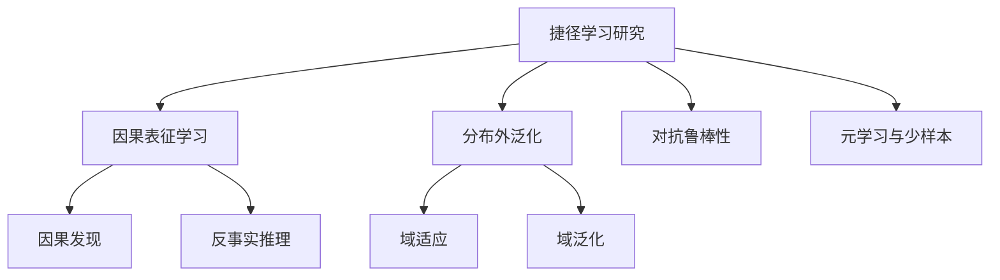

---
aliases:
  - Shortcut Learning
  - 虚假关联学习
  - Spurious Correlation
tags:
  - 机器学习
  - 深度学习
  - AI安全
  - 模型鲁棒性
  - 泛化性
created: 2026-02-11
---
# 捷径学习（Shortcut Learning）

## 概述

**捷径学习**是深度学习模型在训练过程中学习到**虚假关联特征**（spurious correlations）而非真正因果关系的现象。这是当前AI模型面临的最根本挑战之一，揭示了模型"看似聪明，实则脆弱"的本质问题。

> [!important] 核心问题 模型通过简单的表面模式获得高准确率，但这些模式在真实世界中并不可靠。类似于学生通过背答案通过考试，却没有真正理解知识。

## 发生机制

### 根本原因

从优化角度看，深度神经网络是**贪婪的特征提取器**，会优先学习训练数据中最容易分辨、最显著的特征。

#### 1. 数据偏差的必然性

- 收集的数据集总是现实世界的有偏样本
- 训练数据中的偶然关联会被模型当作规律
- 示例：奶牛识别模型可能学会"绿色草地→奶牛"的虚假关联

#### 2. 优化路径的偏好

- 梯度下降选择最短优化路径
- 简单特征能让损失快速下降
- 模型倾向于"懒惰"的解决方案

#### 3. 容量过剩与记忆

- 现代神经网络参数量巨大（数十亿至万亿）
- 有能力记住训练数据的细节和偶然模式
- 不需要提炼可泛化的抽象规则

## 经典案例

### 计算机视觉

#### 哈士奇 vs 狼分类器

- **问题**：通过背景中是否有雪来判断
- **原因**：训练数据中狼的照片多在雪地拍摄
- **后果**：雪地中的哈士奇会被误判为狼

#### 医疗影像分析

- **问题**：肺炎检测依赖X光片上的医院标记
- **原因**：重症患者更可能在特定医院拍摄
- **后果**：模型在其他医院数据上完全失效

### 自然语言处理

#### 情感分析

- 仅依赖"情感词"（terrible, amazing）
- 忽略否定、讽刺等复杂语境
- 对"This movie is not terrible"误判

#### 文本蕴含任务

- 依赖词汇重叠而非真正的语义理解
- 忽略逻辑关系和推理链条

## 深层影响

### 1. 分布外泛化失败 ⚠️

- 在benchmark上表现优秀
- 部署到实际场景后崩溃
- 面对训练数据未见过的微小变化失效

### 2. 隐蔽性危险

- 标准评估难以发现问题
- 测试集与训练集包含相同偏差
- 对脆弱模型产生虚假信心

### 3. 公平性问题

- 放大数据中的社会偏见
- 示例：程序员招聘AI可能歧视女性
- 导致系统性不公平决策

### 4. 安全风险

- 医疗、自动驾驶等高风险领域
- 潜在的错误决策后果严重
- 难以预测的失败模式

## 应对策略

### 数据层面

```markdown
- [ ] 审慎的数据收集策略
- [ ] 引入反事实样本（counterfactual examples）
- [ ] 引入对比样本（contrastive examples）
- [ ] 针对性数据增强打破虚假关联
- [ ] 平衡数据集的分布
```

**关键原则**：主动设计数据来打破虚假关联，而非被动收集

### 模型架构

#### 归纳偏置（Inductive Bias）

- 卷积网络的平移不变性
- 注意力机制的选择性聚焦
- 结构化先验知识的引入

#### 因果推断方法

- 区分相关性和因果性
- 因果图建模
- 干预性学习（interventional learning）

相关笔记：[[因果推断基础]] | [[神经网络架构设计]]

### 训练策略

|方法|核心思想|优势|局限|
|---|---|---|---|
|对抗训练|生成对抗样本增强鲁棒性|显著提升抗干扰能力|计算开销大|
|域随机化|随机化环境参数|提升跨域泛化|需要领域知识|
|多任务学习|同时学习多个相关任务|学习更通用特征|任务设计困难|
|课程学习|从简单到复杂的训练|更稳定的学习|课程设计需要经验|

### 评估方法革新

> [!tip] 超越IID测试 需要系统化的分布外（Out-of-Distribution, OOD）评估基准

- **对抗性评估**：主动寻找模型弱点
- **压力测试**：极端条件下的性能
- **可解释性分析**：
    - 注意力可视化
    - 特征归因方法
    - 概念激活向量（CAV）
- **多样化测试集**：不同分布、不同场景

相关笔记：[[模型评估方法论]] | [[可解释AI技术]]

## 理论思考

### 模式识别 ≠ 智能

真正的智能需要：

1. **抽象能力**：从具体到一般的概括
2. **推理能力**：逻辑链条的构建
3. **因果理解**：而非统计相关性
4. **迁移能力**：知识在不同领域的应用

### 规模的局限性

> [!warning] 规模法则的盲区 更大的模型、更多的数据并不能自动解决捷径学习问题。如果方向错了，规模只会放大错误。

需要平衡：

- **广度**：大规模数据和模型
- **深度**：正确的学习机制

### 捷径学习的"原罪"

- 源于学习算法的数学本质
- 源于数据的必然局限
- 完全消除可能不现实
- 但可以理解、识别、缓解

## 研究前沿

### 当前热点方向



### 需要跨学科融合

- 机器学习
- 认知科学
- 因果推断
- 统计学
- 哲学（认识论）

## 实践建议

### 开发者指南

1. **数据审查**
    
    - 分析数据集的潜在偏差
    - 检查类别间的虚假关联
    - 使用数据可视化工具
2. **模型检查**
    
    - 使用可解释性工具分析决策依据
    - 在多个分布上测试
    - 进行失败案例分析
3. **持续监控**
    
    - 部署后的性能追踪
    - 边缘案例收集
    - 定期重新评估

### 何时应该特别警惕

- [ ] 高风险应用（医疗、金融、司法）
- [ ] 数据收集存在明显偏差
- [ ] 模型性能"好得不真实"
- [ ] 部署环境与训练环境差异大
- [ ] 涉及敏感的社会公平问题

## 相关概念

- [[泛化能力]]
- [[过拟合]]
- [[分布偏移]]
- [[对抗样本]]
- [[因果推断]]
- [[可解释AI]]
- [[模型鲁棒性]]
- [[数据偏差]]

## 参考资源

### 重要论文

- Geirhos et al. (2020) - "Shortcut Learning in Deep Neural Networks"
- Ilyas et al. (2019) - "Adversarial Examples Are Not Bugs, They Are Features"

### 延伸阅读

- [[深度学习的局限性]]
- [[AI安全与对齐问题]]
- [[可信AI技术栈]]

---

**最后更新**：2026-02-11  
**下一步行动**：深入研究因果表征学习方法