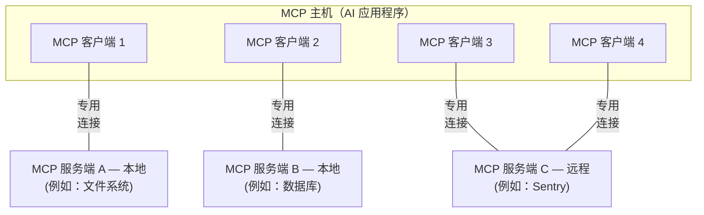

# 架构概览

本《模型上下文协议》（Model Context Protocol，简称 MCP）概览文档阐述了其[适用范围](#scope)与[核心概念](#concepts-of-mcp)，并提供了一个[示例](#example)，用以逐一演示各项核心概念。

由于 MCP 软件开发工具包（SDK）已对诸多实现细节进行了抽象封装，大多数开发者最常参考的将是[数据层协议](#data-layer-protocol)部分。该部分重点说明 MCP 服务器如何向 AI 应用程序提供上下文信息。

如需了解特定编程语言的实现细节，请参阅对应语言的[SDK 文档](/docs/sdk)。

## 适用范围（Scope）

模型上下文协议（MCP）涵盖以下项目：

* [MCP 规范](https://modelcontextprotocol.io/specification/latest)：一份正式规范文档，明确定义了 MCP 客户端与服务器的实现要求；
* [MCP SDK](/docs/sdk)：面向多种编程语言的软件开发工具包，用于便捷地实现 MCP 协议；
* **MCP 开发工具**：用于构建 MCP 服务端与客户端的配套工具，包括 [MCP Inspector](https://github.com/modelcontextprotocol/inspector)（MCP 检查器）；
* [MCP 参考服务端实现](https://github.com/modelcontextprotocol/servers)：MCP 服务端的官方参考实现。

<Note>
  MCP 仅专注于定义上下文交换的通信协议——它**不规定**AI 应用程序如何调用大语言模型（LLM），亦**不限制**应用程序对所获上下文的具体使用方式。
</Note>

## MCP 的核心概念

### 参与方（Participants）

MCP 采用典型的客户端–服务端架构：一个 MCP 主机（MCP Host）——即某款 AI 应用程序（例如 [Claude Code](https://www.anthropic.com/claude-code) 或 [Claude Desktop](https://www.claude.ai/download)）——可建立一个或多个连接，分别对接不同的 MCP 服务端。为实现此目标，MCP 主机会为每个目标 MCP 服务端创建一个独立的 MCP 客户端（MCP Client）。每个 MCP 客户端均与其对应的服务端维持一条专用连接。

通常情况下，采用标准输入/输出（STDIO）传输方式的本地 MCP 服务端仅服务于单个 MCP 客户端；而采用可流式传输的 HTTP（Streamable HTTP）传输方式的远程 MCP 服务端，则通常可同时服务多个 MCP 客户端。

MCP 架构中的关键参与方包括：

* **MCP 主机（MCP Host）**：协调并管理一个或多个 MCP 客户端的 AI 应用程序；
* **MCP 客户端（MCP Client）**：负责与 MCP 服务端建立并维护连接，并为 MCP 主机获取上下文数据的组件；
* **MCP 服务端（MCP Server）**：向 MCP 客户端提供上下文数据的程序。

**举例说明**：Visual Studio Code 充当 MCP 主机。当 VS Code 连接到某个 MCP 服务端（例如 [Sentry MCP 服务端](https://docs.sentry.io/product/sentry-mcp/)）时，VS Code 运行时会实例化一个 MCP 客户端对象，专门用于维护与该 Sentry MCP 服务端的连接。随后，当 VS Code 再次连接到另一个 MCP 服务端（例如 [本地文件系统服务端](https://github.com/modelcontextprotocol/servers/tree/main/src/filesystem)）时，VS Code 运行时将额外实例化一个 MCP 客户端对象，以维护此次新连接。



请注意，“MCP 服务端”一词特指提供上下文数据的程序，与其实际部署位置无关。MCP 服务端既可本地运行，也可远程部署。例如，当 Claude Desktop 启动 [文件系统服务端](https://github.com/modelcontextprotocol/servers/tree/main/src/filesystem) 时，该服务端通过 STDIO 传输方式运行于同一台本地机器上，因此被称作“本地 MCP 服务端”。而官方 [Sentry MCP 服务端](https://docs.sentry.io/product/sentry-mcp/) 则部署在 Sentry 平台上，采用可流式传输的 HTTP 传输方式，故被称作“远程 MCP 服务端”。

### 分层结构（Layers）

MCP 由两个逻辑分层构成：

* **数据层（Data Layer）**：定义基于 JSON-RPC 的客户端–服务端通信协议，涵盖生命周期管理，以及核心原语（primitives），例如工具（Tools）、资源（Resources）、提示词（Prompts）和通知（Notifications）；
* **传输层（Transport Layer）**：定义客户端与服务端之间数据交换所依赖的通信机制与通道，包括传输层专属的连接建立、消息帧封装（message framing）及授权认证等。

从概念上讲，数据层是内层，传输层是外层。

#### 数据层（Data Layer）

数据层基于 [JSON-RPC 2.0](https://www.jsonrpc.org/) 实现一套交换协议，明确定义了消息格式与语义。该层包含以下功能模块：

* **生命周期管理（Lifecycle Management）**：处理客户端与服务端之间的连接初始化、能力协商（capability negotiation）及连接终止；
* **服务端功能（Server Features）**：使服务端能够提供核心能力，包括供 AI 执行操作的“工具”、承载上下文数据的“资源”，以及定义人机交互模板的“提示词”；
* **客户端功能（Client Features）**：使服务端能够请求客户端执行以下操作：调用主机 AI 应用中的大语言模型生成内容（sampling）、向用户发起交互请求（elicit input）、向客户端发送日志消息（logging）；
* **实用功能（Utility Features）**：支持通知（notifications）以实现实时更新，以及进度跟踪（progress tracking）以监控长时间运行的操作。

#### 传输层（Transport Layer）

传输层负责管理客户端与服务端之间的通信通道与身份认证，具体涵盖连接建立、消息帧封装，以及 MCP 各参与方之间的安全通信。

MCP 当前支持两种传输机制：

* **STDIO 传输（Stdio Transport）**：利用标准输入/输出流，在同一台机器上的本地进程间进行直接通信，性能最优，且无任何网络开销；
* **可流式 HTTP 传输（Streamable HTTP Transport）**：客户端通过 HTTP POST 向服务端发送消息，并可选择性地借助服务端推送事件（Server-Sent Events, SSE）实现消息流式传输。该机制支持远程服务端通信，并兼容标准 HTTP 认证方式，包括 Bearer Token、API 密钥及自定义请求头。MCP 推荐使用 OAuth 协议获取认证令牌。

传输层将底层通信细节从协议层中完全解耦，从而确保所有传输机制均可统一采用相同的 JSON-RPC 2.0 消息格式。

### 数据层协议（Data Layer Protocol）

定义 MCP 客户端与服务端之间的数据模式（schema）与语义，是 MCP 的核心任务之一。开发者最感兴趣的部分通常是数据层——尤其是其中定义的一组[原语（primitives）](#primitives)。这正是 MCP 中明确界定“服务端如何向客户端共享上下文”的关键所在。

MCP 以 [JSON-RPC 2.0](https://www.jsonrpc.org/) 作为其底层远程过程调用（RPC）协议。客户端与服务端彼此发送请求，并按约定作出响应；当无需返回响应时，可使用通知（notification）机制。

#### 生命周期管理（Lifecycle Management）

MCP 是一种<Tooltip tip="若采用可流式 HTTP 传输，MCP 的部分功能可设计为无状态">有状态协议</Tooltip>，必须进行生命周期管理。其主要目的在于协商客户端与服务端双方所支持的<Tooltip tip="客户端或服务端所支持的功能与操作，例如工具、资源或提示词">能力（capabilities）</Tooltip>。详细规范请参阅[官方规范文档](/specification/latest/basic/lifecycle)，而[示例部分](#example)则展示了完整的初始化流程。

#### 原语（Primitives）

原语（Primitives）是 MCP 中最为重要的概念，它明确定义了客户端与服务端可相互提供的能力类型。这些原语具体规定了可向 AI 应用程序共享的上下文信息种类，以及可执行的操作范围。

MCP 定义了三种服务端可对外暴露的核心原语：

* **工具（Tools）**：可供 AI 应用程序调用的可执行函数，用于完成各类操作（例如：文件读写、外部 API 调用、数据库查询）；
* **资源（Resources）**：为 AI 应用程序提供上下文信息的数据源（例如：文件内容、数据库记录、API 返回结果）；
* **提示词（Prompts）**：可复用的交互模板，用于结构化语言模型的输入与输出（例如：系统级提示词、少样本（few-shot）示例）。

每种原语类型均配有对应的方法，用于发现（`*/list`）、获取（`*/get`），部分类型还支持执行（如 `tools/call`）。MCP 客户端通过调用 `*/list` 方法来动态发现当前可用的原语。例如，客户端可先调用 `tools/list` 获取所有可用工具列表，再根据需要调用具体工具。这种设计保证了原语列表的动态性与灵活性。

以一个为数据库提供上下文的 MCP 服务端为例：它可暴露用于查询数据库的工具、包含数据库结构定义（schema）的资源，以及一组用于指导如何调用这些工具的少样本提示词（few-shot prompts）。

有关服务端原语的更多细节，请参阅[服务端概念](./server-concepts)。

MCP 同样定义了客户端可对外暴露的原语，使服务端开发者能够构建更丰富、更智能的交互体验：

* **采样（Sampling）**：允许服务端向客户端的 AI 应用程序请求大语言模型补全（completion）。当服务端开发者希望接入 LLM 能力，但又希望保持模型无关性（model-agnostic），避免在其 MCP 服务端中嵌入特定 LLM 的 SDK 时，即可通过 `sampling/complete` 方法向客户端发起补全请求；
* **征询（Elicitation）**：允许服务端向用户请求额外信息。当服务端需要获取用户进一步输入，或就某项操作寻求用户确认时，可通过 `elicitation/request` 方法向用户发起交互请求；
* **日志（Logging）**：允许服务端向客户端发送日志消息，便于调试与运行监控。

有关客户端原语的更多细节，请参阅[客户端概念](./client-concepts)。

除服务端与客户端原语外，协议还提供若干跨领域通用的实用型原语，以增强请求执行能力：

* **任务（Tasks，实验性功能）**：持久化执行封装器，支持 MCP 请求的延迟结果获取与状态跟踪（例如：高开销计算、工作流自动化、批量处理、多步骤操作）。

#### 通知（Notifications）

该协议支持实时通知机制，以实现服务端与客户端之间的动态更新。例如，当服务端所支持的工具集发生变化（如新增功能或现有工具被修改），服务端即可主动向已连接的客户端发送工具变更通知（tool update notifications），及时同步变更信息。此类通知以 JSON-RPC 2.0 的 notification 消息形式发出（不期待响应），从而赋能 MCP 服务端向客户端提供实时更新能力。

## 示例（Example）

### 数据层（Data Layer）

本节将通过一个逐步演示的方式，介绍 MCP 客户端与服务端在数据层协议层面的典型交互过程。我们将结合 JSON-RPC 2.0 消息，依次展示生命周期管理流程、工具操作以及通知机制的实际应用。

#### 初始化（生命周期管理）  
MCP 的生命周期管理始于一次能力协商握手。如[生命周期管理](#lifecycle-management)一节所述，客户端首先发送一个 `initialize` 请求，以建立连接并协商双方支持的功能特性。

```json 初始化请求 theme={null}
{
  "jsonrpc": "2.0",
  "id": 1,
  "method": "initialize",
  "params": {
    "protocolVersion": "2025-06-18",
    "capabilities": {
      "elicitation": {}
    },
    "clientInfo": {
      "name": "example-client",
      "version": "1.0.0"
    }
  }
}
```

```json 初始化响应 theme={null}
{
  "jsonrpc": "2.0",
  "id": 1,
  "result": {
    "protocolVersion": "2025-06-18",
    "capabilities": {
      "tools": {
        "listChanged": true
      },
      "resources": {}
    },
    "serverInfo": {
      "name": "example-server",
      "version": "1.0.0"
    }
  }
}
```


#### 理解初始化交互过程  

初始化流程是 MCP 生命周期管理的关键环节，承担多项核心职责：

1. **协议版本协商**：`protocolVersion` 字段（例如 `"2025-06-18"`）确保客户端与服务器使用兼容的协议版本，从而避免因版本不一致导致的通信错误。若双方无法就一个共同支持的协议版本达成一致，则应终止连接。

2. **能力发现（Capability Discovery）**：`capabilities` 对象允许通信双方各自声明其支持的功能特性，包括可处理哪些[MCP 基元（primitives）](#primitives)（如工具 tools、资源 resources、提示 prompts），以及是否支持[通知（notifications）](#notifications)等功能。这使得客户端可提前规避调用服务端不支持的操作，提升通信效率与健壮性。

3. **身份信息交换**：`clientInfo` 和 `serverInfo` 对象分别提供客户端与服务端的名称及版本号，便于调试、日志追踪和兼容性校验。

在本示例中，能力协商清晰展示了 MCP 各基元如何被声明：

**客户端能力声明**：  
* `"elicitation": {}` —— 客户端声明其支持用户交互类请求（即能够接收并处理 `elicitation/create` 方法调用）

**服务端能力声明**：  
* `"tools": {"listChanged": true}` —— 服务端支持 *tools* 基元，并且具备主动推送 `tools/list_changed` 通知的能力（当其可用工具列表发生变化时自动通知客户端）  
* `"resources": {}` —— 服务端同样支持 *resources* 基元（即能够处理 `resources/list` 和 `resources/read` 等方法调用）

初始化成功完成后，客户端需发送一条通知，表明自身已准备就绪：

```json 通知消息 theme={null}
{
  "jsonrpc": "2.0",
  "method": "notifications/initialized"
}
```


#### 在 AI 应用中的实际运作方式  

在初始化阶段，AI 应用的 MCP 客户端管理器会连接至预配置的服务端，并将各服务端返回的能力信息（capabilities）持久化存储，供后续运行时使用。应用据此判断：哪些服务端可提供特定类型的功能（如工具、资源或提示），以及它们是否支持实时变更通知等高级特性。

```python AI 应用初始化伪代码 theme={null}
# 伪代码
async with stdio_client(server_config) as (read, write):
    async with ClientSession(read, write) as session:
        init_response = await session.initialize()
        if init_response.capabilities.tools:
            app.register_mcp_server(session, supports_tools=True)
        app.set_server_ready(session)
```


#### 工具发现（基元机制）  
连接建立后，客户端可通过发送 `tools/list` 请求，获取服务端当前可用的所有工具。该请求是 MCP 工具发现机制的核心——它使客户端能在实际调用前，全面了解服务端所暴露的工具集及其详细接口定义。

```json 工具列表请求 theme={null}
{
  "jsonrpc": "2.0",
  "id": 2,
  "method": "tools/list"
}
```

```json 工具列表响应 theme={null}
{
  "jsonrpc": "2.0",
  "id": 2,
  "result": {
    "tools": [
      {
        "name": "calculator_arithmetic",
        "title": "计算器",
        "description": "执行数学计算，包括基础四则运算、三角函数及代数运算",
        "inputSchema": {
          "type": "object",
          "properties": {
            "expression": {
              "type": "string",
              "description": "待求值的数学表达式（例如：'2 + 3 * 4'、'sin(30)'、'sqrt(16)'）"
            }
          },
          "required": ["expression"]
        }
      },
      {
        "name": "weather_current",
        "title": "天气信息",
        "description": "获取全球任意地点的当前天气状况",
        "inputSchema": {
          "type": "object",
          "properties": {
            "location": {
              "type": "string",
              "description": "城市名、地址或地理坐标（纬度,经度）"
            },
            "units": {
              "type": "string",
              "enum": ["metric", "imperial", "kelvin"],
              "description": "响应中温度所采用的单位",
              "default": "metric"
            }
          },
          "required": ["location"]
        }
      }
    ]
  }
}
```


#### 理解工具发现请求  

`tools/list` 请求结构极为简洁，不携带任何参数。


#### 理解工具发现响应  

响应体包含一个 `tools` 数组，其中每一项均完整描述了一个可用工具的元数据。该数组结构使服务端能一次性批量暴露多个工具，同时保持各工具功能边界清晰、语义明确。

每个工具对象包含以下关键字段：

* **`name`**：该工具在服务端命名空间内的唯一标识符。它是工具执行时的主键，应遵循清晰、可读的命名规范（例如推荐使用 `calculator_arithmetic`，而非模糊的 `calculate`）  
* **`title`**：面向用户的友好显示名称，客户端可直接用于界面展示  
* **`description`**：对工具功能的详尽说明，包括适用场景与典型用例  
* **`inputSchema`**：一份 JSON Schema 定义，精确描述工具所需的输入参数结构，既支持运行时类型校验，也为开发者提供直观、自解释的接口文档  


#### 在 AI 应用中的实际运作方式  

AI 应用会从所有已连接的 MCP 服务端拉取可用工具列表，并将其聚合为一个统一的“工具注册中心”（tool registry），供语言模型（LLM）直接访问。这使得 LLM 能够准确理解自身可调用的能力范围，并在对话过程中自动、动态地生成符合规范的工具调用指令。

```python AI 应用工具发现伪代码 theme={null}
# 遵循 MCP Python SDK 设计模式的伪代码
available_tools = []
for session in app.mcp_server_sessions():
    tools_response = await session.list_tools()
    available_tools.extend(tools_response.tools)
conversation.register_available_tools(available_tools)
```


#### 工具执行（基元机制）  
客户端现已可通过 `tools/call` 方法执行具体工具。此过程体现了 MCP 基元的实际应用范式：在完成工具发现后，客户端即可依据工具元数据，向服务端发起带参调用。

#### 理解工具执行请求  

`tools/call` 请求采用结构化格式，确保客户端与服务端间通信的类型安全与语义清晰。注意：此处严格使用工具发现响应中返回的正式名称（`weather_current`），而非简化名。

```json 工具调用请求 theme={null}
{
  "jsonrpc": "2.0",
  "id": 3,
  "method": "tools/call",
  "params": {
    "name": "weather_current",
    "arguments": {
      "location": "旧金山",
      "units": "imperial"
    }
  }
}
```

```json 工具调用响应 theme={null}
{
  "jsonrpc": "2.0",
  "id": 3,
  "result": {
    "content": [
      {
        "type": "text",
        "text": "旧金山当前天气：68°F（约20°C），局部多云，西风微拂（风速8英里/小时），湿度65%。"
      }
    ]
  }
}
```


#### 工具执行的关键要素  

请求结构包含以下重要组成部分：

1. **`name`**：必须与工具发现响应中返回的工具名称完全一致（如 `weather_current`），以确保服务端能精准匹配并执行对应工具。  
2. **`arguments`**：传入的参数须严格遵循该工具 `inputSchema` 所定义的结构。本例中：  
   * `location`: `"旧金山"`（必填参数）  
   * `units`: `"imperial"`（可选参数；若未指定，则按 `inputSchema` 中的 `default` 值 `"metric"` 处理）  
3. **JSON-RPC 结构**：严格遵循 JSON-RPC 2.0 标准，通过唯一的 `id` 字段实现请求与响应的精确关联。


#### 理解工具执行响应  

响应体展现了 MCP 灵活的内容交付体系：

1. **`content` 数组**：工具响应以内容对象（content object）数组形式返回，支持富媒体、多模态输出（如纯文本、图像、资源链接等）。  
2. **内容类型（Content Types）**：每个内容对象均含 `type` 字段。本例中 `"type": "text"` 表示纯文本内容；MCP 同样原生支持其他类型（如 `"image"`、`"resource"` 等），以适配多样化应用场景。  
3. **结构化输出**：响应内容为结构化的、可直接解析的语义信息，AI 应用可将其无缝注入语言模型的上下文（context），驱动更智能、更落地的对话交互。

这一执行模式使 AI 应用得以动态调用外部服务端能力，并将结构化结果自然融入大模型推理流程，显著扩展其现实世界交互能力。


#### 如何在 AI 应用中实现  

当语言模型在对话中决定调用某工具时，AI 应用会拦截该意图，将其路由至对应的 MCP 服务端执行，再将执行结果作为上下文反馈给 LLM，从而形成闭环的“感知-决策-行动”链路。这使 LLM 不仅能生成文本，更能实时获取外部数据、执行真实操作。

```python  theme={null}
# AI 应用工具调用处理伪代码
async def handle_tool_call(conversation, tool_name, arguments):
    session = app.find_mcp_session_for_tool(tool_name)
    result = await session.call_tool(tool_name, arguments)
    conversation.add_tool_result(result.content)
```


#### 实时更新（通知机制）  
MCP 内置通知（Notifications）机制，允许服务端在无需客户端显式请求的前提下，主动向客户端推送状态变更事件。该机制是 MCP 实现连接同步性与响应敏捷性的核心设计之一。

#### 理解工具列表变更通知  

当服务端可用工具集发生变更时（例如：新增功能上线、现有工具升级、或因权限/依赖问题导致工具临时不可用），服务端可主动向所有已连接客户端广播变更通知：

```json 通知请求 theme={null}
{
  "jsonrpc": "2.0",
  "method": "notifications/tools/list_changed"
}
```


#### MCP 通知机制的关键特性  

1. **无响应要求（Fire-and-Forget）**：通知消息中不含 `id` 字段，严格遵循 JSON-RPC 2.0 规范中“通知”的语义——即服务端单向推送，客户端无需、也不应返回任何响应。  
2. **基于能力启用（Capability-Gated）**：此类通知仅由在初始化阶段于 `capabilities.tools` 中声明 `"listChanged": true` 的服务端发出（如步骤 1 所示）。  
3. **事件驱动（Event-Driven）**：通知触发时机完全由服务端内部状态变化决定，而非固定轮询，使整个 MCP 连接具备高度动态性与实时响应能力。


#### 客户端对通知的响应  

客户端收到 `tools/list_changed` 通知后，通常立即发起一次新的 `tools/list` 请求，以刷新本地缓存的工具清单。这一“通知→拉取→更新”的闭环构成了高效的工具状态同步机制：

```json 请求 theme={null}
{
  "jsonrpc": "2.0",
  "id": 4,
  "method": "tools/list"
}
```


#### 为何通知机制至关重要？  

该机制在以下方面具有不可替代的价值：

1. **适应动态环境**：工具的可用性可能随服务端运行状态、外部依赖健康度或用户权限策略实时变化；  
2. **提升通信效率**：客户端无需低效轮询（polling），仅在真正有变更时才触发更新，大幅降低网络与计算开销；  
3. **保障状态一致性**：确保客户端始终掌握服务端最新、最准确的能力视图，避免因过期缓存导致调用失败；  
4. **支撑实时协作场景**：赋能 AI 应用快速感知上下文变化，实现更自然、更鲁棒的人机协同体验。

此通知范式不仅适用于工具（tools），也延伸至资源（resources）、提示（prompts）等所有 MCP 基元，构建起一套覆盖全协议栈的、端到端的实时同步能力。


#### 在 AI 应用中的实际运作方式  

当 AI 应用接收到工具变更通知时，会立即刷新其内部工具注册中心，并同步更新语言模型（LLM）当前可调用的能力集合。此举确保正在进行的对话始终能访问最新工具集，使 LLM 可在新功能上线的瞬间即刻感知并加以利用，真正实现能力的“热插拔”与动态演进。

```python  theme={null}
# AI 应用通知处理伪代码
async def handle_tools_changed_notification(session):
    tools_response = await session.list_tools()
    app.update_available_tools(session, tools_response.tools)
    if app.conversation.is_active():
        app.conversation.notify_llm_of_new_capabilities()
```
