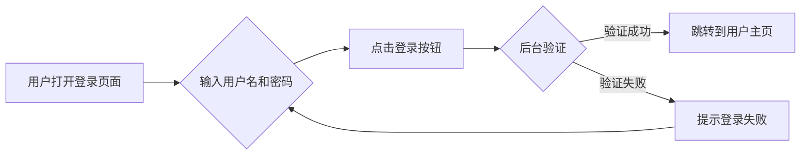
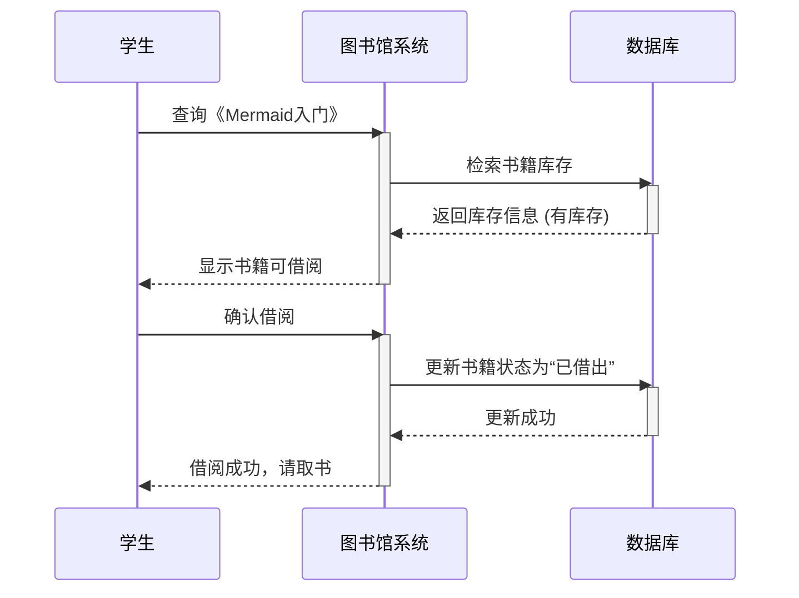
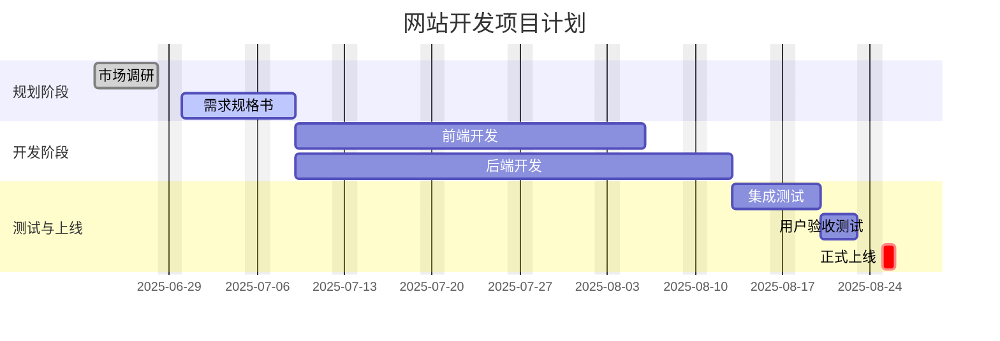
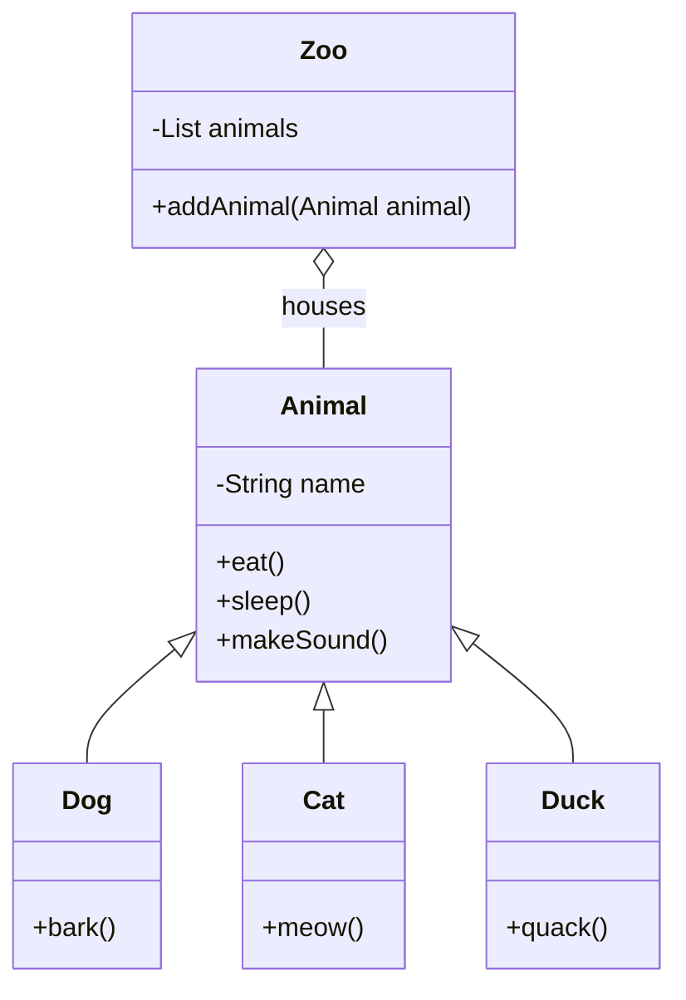
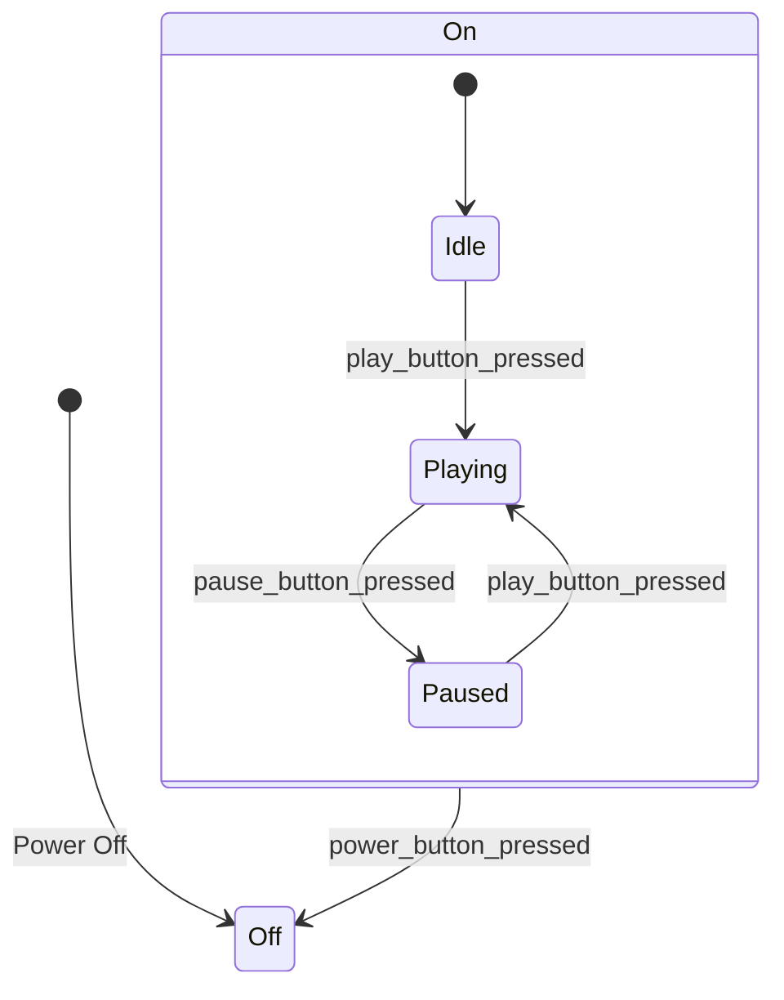
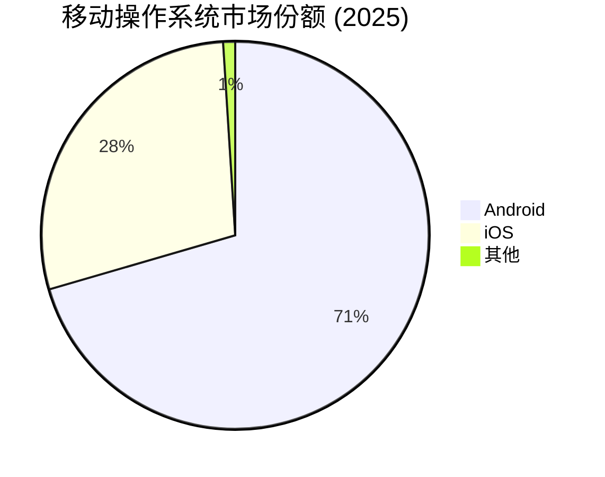
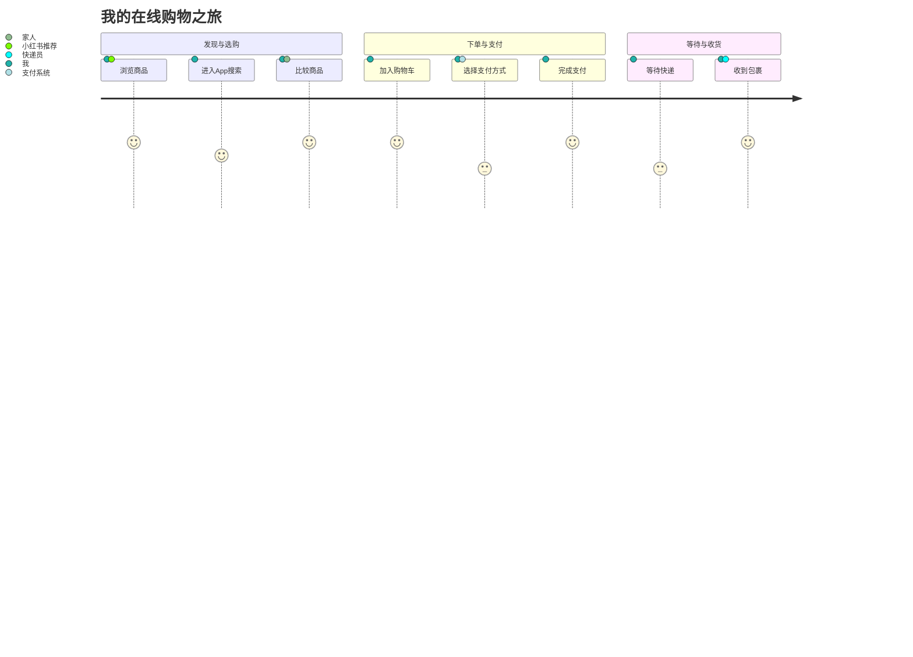
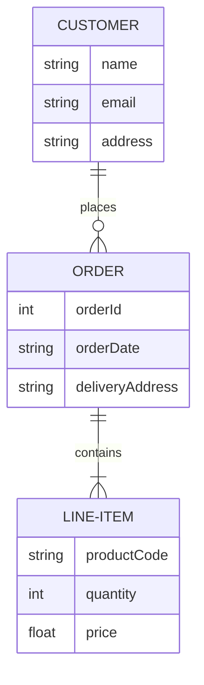
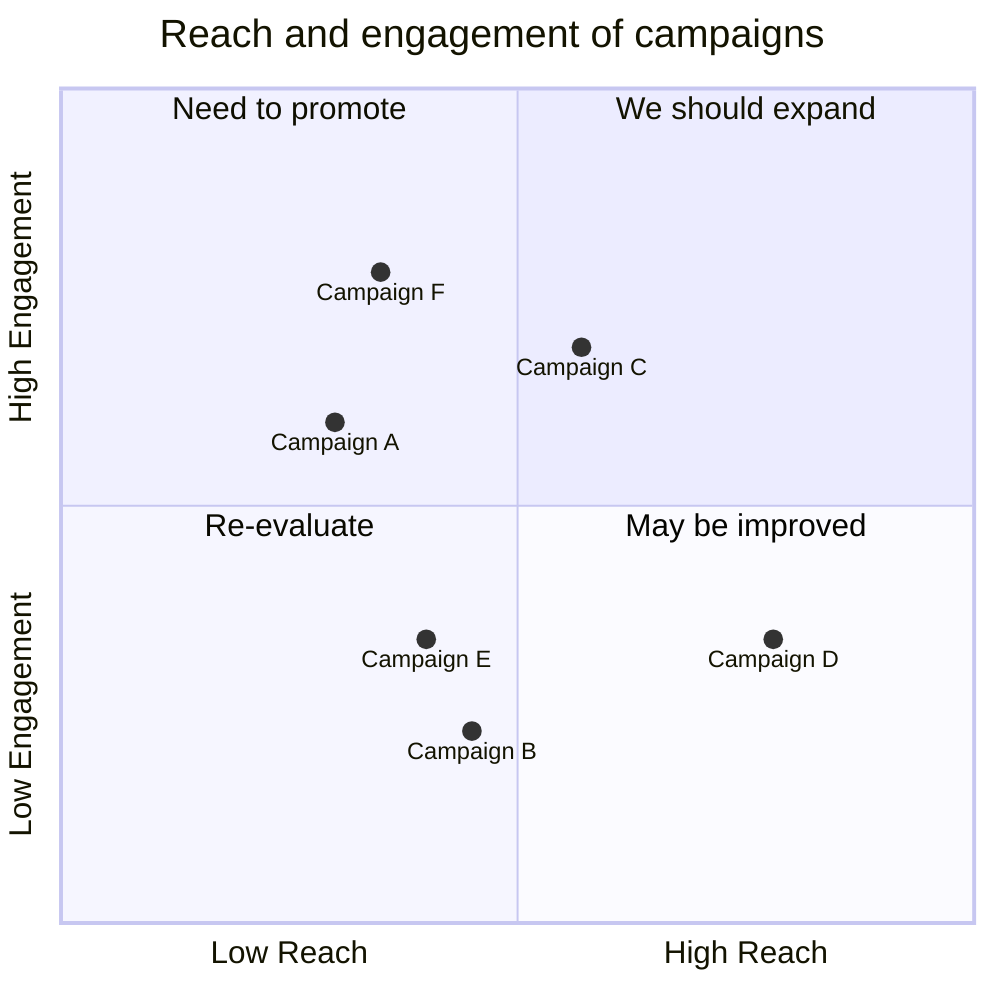

# 概述
## Mermaid：将文本被转化为图表的利器
Mermaid，作为一个强大的 JavaScript 图表库，正在彻底改变开发者、文档撰写者和项目经理创建和维护图表的方式。它以其 “代码即图表” (diagrams as code) 的理念，允许用户使用类似 Markdown 的简单文本语法，轻松生成各种复杂的图表和可视化内容。从流程图、序列图到甘特图和状态图，Mermaid 都能将纯文本描述渲染成清晰、美观的矢量图形。

# 分类
| 图表类型                   | 英文名称                        | 描述                           |
| :--------------------- | :-------------------------- | :--------------------------- |
| [流程图](mermaid.md#流程图)     | Flowchart                   | 用于表示工作流程、算法或决策过程。            |
| [序列图](mermaid.md#序列图)     | Sequence Diagram            | 展示对象之间交互的时间顺序。               |
| [甘特图](mermaid.md#甘特图)     | Gantt Chart                 | 用于项目管理，展示任务的排期和进度。           |
| [类图](mermaid.md#类图)       | Class Diagram               | 在面向对象设计中，描述类的结构和关系。          |
| [状态图](mermaid.md#状态图)     | State Diagram               | 描述对象在其生命周期内所经历的各种状态以及状态间的转换。 |
| [饼图](mermaid.md#饼图)       | Pie Chart                   | 用于展示各部分占整体的比例。               |
| [用户旅程图](mermaid.md#用户旅程图) | User Journey Diagram        | 描绘用户在使用产品或服务过程中的体验和步骤。       |
| [实体关系图](mermaid.md#实体关系图) | Entity Relationship Diagram | 用于数据库设计，展示实体、属性以及它们之间的关系。    |
| [象限图](mermaid.md#象限图)     | Quadrant chart              |                              |
|                        |                             |                              |
## 图表类型
### 流程图
- 流程图用于展示一个过程或工作流。这个例子描绘了一个简单的用户登录验证流程。

### 序列图
- 序列图用于展示对象之间按时间顺序的交互。这个例子展示了学生向图书馆借书的过程。

### 甘特图
- 甘特图是项目管理的常用工具，用于展示任务的时间安排。

### 类图
- 类图用于描述系统的静态结构，包括类、属性、方法以及它们之间的关系。

### 状态图
- 状态图用于描述一个对象在其生命周期内所经历的状态以及触发状态转换的事件。

### 饼图
- 饼图用于直观地展示各部分占整体的比例。

### 用户旅行图
- 用户旅程图描绘了用户为实现某个目标而与产品或服务进行交互的完整过程。

### 实体关系图
- 实体关系图（ERD）用于数据库设计，展示实体、属性以及它们之间的关系。

### 象限图

