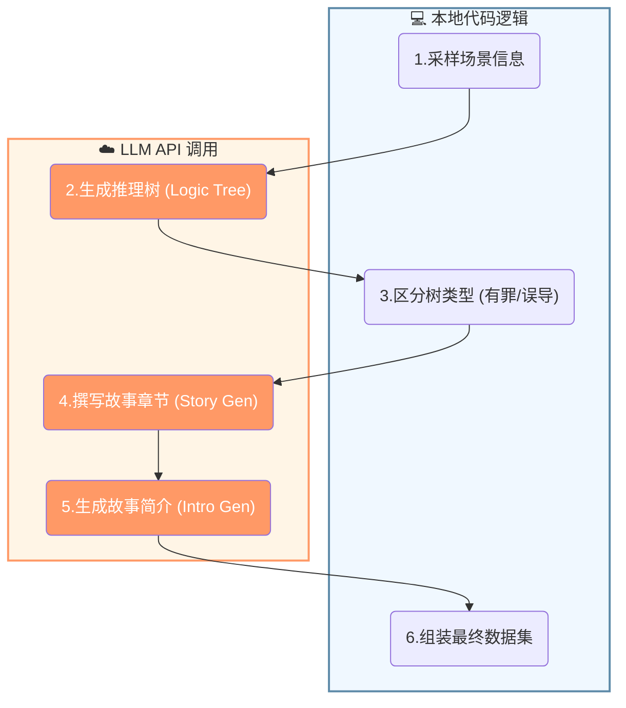
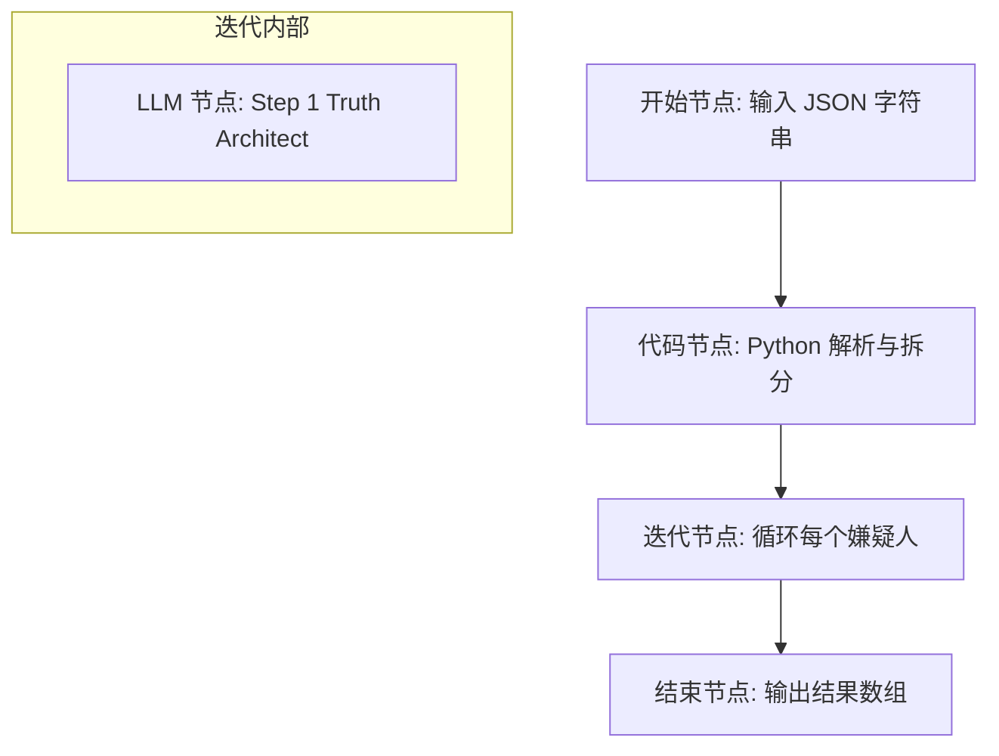

# Murder Mystery 题目生成完整流程

## 一、整体流程概览


---

## 二、详细 API 调用分析

### 阶段1: `create_suspect_trees` - 生成嫌疑人推理树

**对每个嫌疑人**，需要完成两棵树的填充：

#### 1.1 MMO树（Means/Motive/Opportunity）
```
嫌疑人 is the murderer
├── 嫌疑人 has a means     → 需要填充子节点
├── 嫌疑人 has an opportunity → 需要填充子节点
└── 嫌疑人 has a motive    → 需要填充子节点
```

#### 1.2 Suspicious Facts树（可疑事实/红鲱鱼）
```
Some suspicious facts about 嫌疑人
└── [红鲱鱼事实] And this is suspicious → 需要填充子节点
```

**每个待填充节点的 API 调用**（在 `iteratively_complete_v2` 中）：

| 步骤 | Prompt模板 | API调用次数（最少） | API调用次数（最多） |
|------|-----------|-------------------|-------------------|
| 生成推导 | `_mm_completion_prompt_intro_` | 1次 | 1 + max_retries |
| ModelValidator校验(means分支) | "proving a means..." | 0~2次（early_escape + main） | 0~2次 |
| ModelValidator校验(motive分支) | "proving a motive..." | 0~2次 | 0~2次 |
| ModelValidator校验(opportunity分支) | "proving an opportunity..." | 0~2次 | 0~2次 |

**核心 Prompt 模板内容：**

**① MMO树节点填充 Prompt（`_mm_completion_prompt_intro_`）**：
```
你的任务是为故事生成一个逻辑树……
我们正在创作一部谋杀推理故事。推理故事需要包含一张错综复杂的证据网，指向作案手段、动机和机会……

当嫌疑人能够获取凶器时，即具备作案手段 (Means)。
当嫌疑人有理由杀害受害者时，即具备作案动机 (Motive)。
当嫌疑人身处案发现场时，即具备作案机会 (Opportunity)。

[ICL示例 1-3]

现在轮到你了。
场景：{description}
当前逻辑树：{当前树状态}
待补全的推理步骤：{待填充的节点}
```

> [!NOTE]- 
> ```
> 你的任务是按照示例所示，为故事生成一个逻辑树。在树中，每个事实节点都必须由其直接子节点推导得出。如果推导出的事实已有名称，请勿覆盖。
> 
> 故事类型：
> 
> 我们正在创作一部谋杀推理故事。推理故事需要构建一张错综复杂的证据网，指向嫌疑人的作案手段 (Means)、动机 (Motive) 和机会 (Opportunity)，从而使其成为可能的凶手。在撰写推理故事时，应采用侦探的视角。证据应当通过调查获取，包括审讯、监听谈话、查阅过往犯罪记录、检查信件或垃圾，以及其他常规的侦查手段。
> 
> 1. 树中的每个事实都必须通过逻辑推导源自其子节点。
> 2. 所有“故事事实 (Fact From Story)”节点和“常识知识 (Commonsense Knowledge)”节点必须与其产生的推导结果相关。
> 3. 每个根事实都需标注来源（“故事事实”或“常识知识”）。
> 4. “故事事实”应当是关于故事中人物、地点或物体的陈述。
> 5. “常识知识”应当是大多数人都知晓并认同的事实。它**不应**明确提及故事中的任何角色。
> 6. “常识知识”应作为推导规则使用，即当其兄弟节点的事实应用该规则时，能够推导出父节点的事实。
> 7. 你生成的逻辑树必须与我给出的树结构保持一致。
> 
> 定义：
> 当嫌疑人能够获取凶器时，即具备作案手段 (Means)。
> 当嫌疑人有理由杀害受害者时，即具备作案动机 (Motive)。
> 当嫌疑人身处案发现场时，即具备作案机会 (Opportunity)。
> 
> 注意：即使父节点的事实显得荒诞或离奇，你也必须严格遵循。
> 
> 以下是一个示例：
> 场景：受害者：Victoria；案发现场：家中；凶器：枪；嫌疑人：James；嫌疑人角色：兄弟；嫌疑人动机：经济利益
> 
> 当前逻辑树：
> James 是凶手。 | 推导出的根结论 (Deduced Root Conclusion)
> > James 具备作案手段。 | 推导出的事实 (Deduced Fact)
> > > James 练习过射击。 | 故事事实 (Fact From Story)
> > > James 拥有枪支。 | 故事事实 (Fact From Story)
> > > 如果一个人既拥有枪支又练习过射击，那么他就具备杀人的能力。 | 常识知识 (Commonsense Knowledge)
> > James 具备作案动机。 | 推导出的事实 (Deduced Fact)
> > > James 极度渴望金钱。 | 故事事实 (Fact From Story)
> > > James 极度渴望 Victoria 的钱。 | 故事事实 (Fact From Story)
> > > 当一个人极度渴望某样东西时，他们可能会采取极端措施（包括杀人）来达成目的。 | 常识知识 (Commonsense Knowledge)
> > James 具备作案机会。 | 故事事实 (Fact From Story)
> 
> 待补全的推理步骤：
> James 是凶手。
> > James 具备作案机会。 原因如下：
> > > 故事事实 (Fact From Story)
> > > 常识知识 (Commonsense Knowledge)
> 
> 输出：
> James 是凶手。
> > James 具备作案机会。 原因如下：
> > > James 拥有进入 Victoria 房子的权限。 | 故事事实 (Fact From Story)
> > > 拥有进入某人房子的权限使人具备杀害该人的作案机会。 | 常识知识 (Commonsense Knowledge)
> 
> 这里有另一个示例。
> [ICL示例 2-3 格式相同...]
> 
> 现在轮到你了。
> 场景：{description}
> 当前逻辑树：{tree.print_for_gpt(...)}
> 待补全的推理步骤：{node_str(node, ...)}
> 输出：
> ```

**② **红鲱鱼树节点填充 Prompt (`_mm_suspicious_prompt_intro_`）**:
```
你的任务是为故事生成一个逻辑树……
我们正在创作一部谋杀推理故事。推理故事需要构建一张错综复杂的证据网，其中包含可疑的事实，但这些事实最终应属于“误导线索（Red Herrings）”（即它们不能证明该人有罪）。

在此步骤中，我们要设计“误导线索”，即那些看起来很可疑，但并不能据此定罪嫌疑人的线索。你**不要**证明嫌疑人有罪。

[ICL示例 1-3]

现在轮到你了。
场景：{cf_description}  # 格式："{suspect_name} 是一名 {role}……且他非常可疑。"
当前逻辑树：{当前树状态}
待补全的推理步骤：{待填充的节点}
```
> [!NOTE]- 
> ```
> 你的任务是按照示例所示，为故事生成一个逻辑树。在树中，每个事实节点都必须由其直接子节点推导得出。如果推导出的事实已有名称，请勿覆盖。
> 
> 故事类型：
> 我们正在创作一部谋杀推理故事。推理故事需要构建一张错综复杂的证据网，其中包含可疑的事实，但这些事实最终应属于“误导线索（Red Herrings）”（即它们不能证明该人有罪）。
> 
> 在此步骤中，我们要设计“误导线索”，即那些看起来很可疑，但并不能据此定罪嫌疑人的线索。你**不要**证明嫌疑人有罪。
> 
> 1. 树中的每个事实都必须通过逻辑推导源自其子节点。
> 2. 所有“故事事实 (Fact From Story)”节点和“常识知识 (Commonsense Knowledge)”节点必须与其产生的推导结果相关。
> 3. 每个根事实都需标注来源（“故事事实”或“常识知识”）。
> 4. “故事事实”应当是关于故事中人物、地点或物体的陈述。
> 5. “常识知识”应当是大多数人都知晓并认同的事实。它**不应**明确提及故事中的任何角色。
> 6. “常识知识”应作为推导规则使用，即当其兄弟节点的事实应用该规则时，能够推导出父节点的事实。
> 7. 你生成的逻辑树必须与我给出的树结构保持一致。
> 
> 以下是一个示例。
> 场景：Paul 和 Alice 在一家卡拉OK酒吧。
> 当前逻辑树：
> Paul 和 Alice 在一家卡拉OK酒吧。 | 推导出的根结论 (Deduced Root Conclusion)
> > 开场场景 (Opening Scene) | 推导出的事实 (Deduced Fact)
> > > Paul 看见舞台上的麦克风。 | 故事事实 (Fact From Story)
> > > Alice 看见舞台上的麦克风。 | 故事事实 (Fact From Story)
> > > Paul 看见吧台上的啤酒。 | 故事事实 (Fact From Story)
> > > Alice 看见吧台上的啤酒。 | 故事事实 (Fact From Story)
> > Paul 把啤酒移到了桌子上。 | 推导出的事实 (Deduced Fact)
> > > Alice 没有看见啤酒被移到桌子上。 | 推导出的事实 (Deduced Fact)
> ...
> 
> 待补全的推理步骤：
> Paul 和 Alice 在一家卡拉OK酒吧。
> > Alice 把啤酒移到了垃圾桶。
> > > Paul 没有看见啤酒被移到垃圾桶。 原因如下：
> > > > 故事事实 (Fact From Story)
> > > > 故事事实 (Fact From Story)
> > > > 常识知识 (Commonsense Knowledge)
> 
> 输出：
> Paul 和 Alice 在一家卡拉OK酒吧。
> > Alice 把啤酒移到了垃圾桶。
> > > Paul 没有看见啤酒被移到垃圾桶。 原因如下：
> > > > Alice 骗 Paul 看向“那边”。 | 故事事实 (Fact From Story)
> > > > Alice 指向与垃圾桶相反的方向给 Paul 看。 | 故事事实 (Fact From Story)
> > > > 如果你骗某人看向别处，他们就看不到反方向发生的事情。 | 常识知识 (Commonsense Knowledge)
> 
> 这里有另一个示例。
> [ICL示例 2-3...]
> 
> 现在轮到你了。
> 场景：{cf_description}  # 格式: "{suspect_name} 是一名 {role}……且他非常可疑。"
> 当前逻辑树：{tree.print_for_gpt(...)}
> 待补全的推理步骤：{node_str(node, ...)}
> 输出：
> ```


**③ **ModelValidator Prompt（校验推导是否越界）**：
```
我们正在创作一部谋杀推理故事，为此我们需要构建一份证据叙事指南。
当前，我们正在论证 [作案手段/动机/机会]。

基于下方对案件的描述，这一推导是否在某种程度上证明了（或有助于证明）[其他两项]？

{description}

推导内容：
{raw_output}

请简要描述你的推理过程，然后按照以下格式回答：
ANSWER: (yes/no)
```
  
**④ fact_recall_story_validation Prompt（`_mm_suspicious_prompt_intro_`）**：
```
以下是一则故事：
{ctx}

以下是事实清单：
1 - {fact1}
2 - {fact2}
...

上述事实是否在给定的故事中得到了支持？
请务必按照以下格式回答：
"Fact Answer - (Fact idx): (你的逐步推理过程), ANSWER: Yes" 或 "ANSWER: No"
```


---

### 阶段2: `create_chapter` - 生成故事章节

**对每个嫌疑人**，生成2个章节（有罪版本 + 无罪版本）

| 步骤         | Prompt模板                          | API调用次数           |
| ---------- | --------------------------------- | ----------------- |
| 生成有罪章节     | `create_story_prompt__facts_only` | 1次                |
| 验证事实覆盖(有罪) | `fact_recall_story_validation`    | 0~6次（最多重试3轮，每轮2次） |
| 生成无罪章节     | `create_story_prompt__facts_only` | 1次                |
| 验证事实覆盖(无罪) | `fact_recall_story_validation`    | 0~6次              |

**⑤ 故事生成 Prompt（`create_story_prompt__facts_only`）**：
```
我们正在创作一部谋杀推理故事……我们会提供一份事实清单供你在撰写故事时使用。你必须在故事中包含清单上的所有事实。

规则：
1. 仅撰写章节的正文内容……
2. 切勿直接陈述嫌疑人具备作案手段
3. 切勿直接陈述嫌疑人拥有作案动机
4. 切勿直接陈述嫌疑人拥有作案机会
……

嫌疑人与案件信息
{description}

你必须包含的事实：
{facts_list}
```
> [!NOTE]-
> ```
> 我们正在创作一部谋杀推理故事。推理故事需要为嫌疑人构建一张错综复杂的证据网。在撰写推理故事时，故事应采用侦探的视角。证据应当通过调查来收集，包括审讯、监听谈话、查阅过往犯罪记录、查看信件或垃圾，以及其他常规的侦查手段。
> 
> 我们会提供一份事实清单供你在撰写故事时使用。你必须在故事中包含清单上的所有事实。**切勿陈述推导出的事实或结论。**故事内容应紧扣事实清单。
> 
> 你要为这部推理小说撰写一个章节。本章节不应介绍谋杀案本身或受害者，而应严格跟随侦探的视角，描写他对嫌疑人进行的缓慢审讯和侦查过程。请使用下方的清单作为指南。
> 
> 规则：
> 1. 仅撰写章节的正文内容，不要写标题或编号。这段文字必须能轻易地嵌入到一个更长的故事中。
> 2. 切勿直接陈述嫌疑人具备作案手段 (Means)。
> 3. 切勿直接陈述嫌疑人拥有作案动机 (Motive)。
> 4. 切勿直接陈述嫌疑人拥有作案机会 (Opportunity)。
> 5. 切勿暗示嫌疑人具备或不具备作案手段、动机或机会。切勿暗示或明确说出任何推导出的事实。
> 6. 切勿说嫌疑人是凶手。这是一个需要读者去猜测和推理的谜题！
> 7. 以侦探通过各种常规手段（审讯、查阅笔记、蹲点监视等）揭示线索的视角来撰写故事。
> 8. **切勿**让侦探做心理笔记、指出可疑事实，或在事实之间建立联系。让读者自己去完成这些工作。
> 
> 根据需要撰写尽可能多的句子，以将事实清单中的每个事实都写进去。同时请包含最多 10 句对话。
> 
> 以下是一个示例：
> 嫌疑人与案件信息
> 受害者：Dora
> 案发现场：偏远的森林
> 凶器：刀
> 嫌疑人：Willard
> 故事角色：场地管理员
> 嫌疑人动机：宗教祭祀
> 你是温斯顿侦探 (Detective Winston)。
> 
> 你必须包含的事实：
> - 一名目击者看到有人长着“意大利面条脸”和绿色的耳朵。
> - Willard 是当地一所学校的场地管理员。
> - Willard 也为附近的居民提供服务，如房屋粉刷、草坪护理等。
> - Willard 把附近的一所房子漆成了绿色。
> - Willard 小时候曾遭遇过一场可怕的火灾。
> - Willard 的家族已经在当地生活了几代人。
> - 很久以前，该地区周围有宗教极端分子，且都参与邪教活动。
> - Willard 和他的直系亲属都是某种类型的勤杂工。
> - Willard 坚信要尊重长辈和祖先的历史。
> - Dora 曾写过关于加入附近一个新教会的事。
> - Dora 的一位朋友提到，很担心 Dora 卷入了一群类似邪教的新朋友圈子。
> 
> 输出：
> 温斯顿深深地吸了一口烟，一边审视着案发现场的照片……[完整ICL示例故事内容]
> 
> ---
> 现在轮到你了。
> 
> 嫌疑人与案件信息
> {description}
> 
> 你是温斯顿侦探。
> 
> 你必须包含的事实：
> {facts_str}
> 
> 输出：
> ```

**⑥ 事实验证 Prompt**：
```
以下是一则故事：
{ctx}

以下是事实清单：
1 - {fact1}
2 - {fact2}
...

上述事实是否在给定的故事中得到了支持？
请务必按照以下格式回答：
"Fact Answer - (Fact idx): (你的逐步推理过程), ANSWER: Yes" 或 "ANSWER: No"
```

**⑦ 故事修复 Prompt**（如果有不支持的事实）：
```
我们正在修改刚才撰写的一则故事。按照要求，该故事必须包含能够支持一份事实清单的证据，但目前并非所有事实都得到了支持。
你的任务是修改这则故事，确保清单上的所有事实都能得到支持。

故事： {story}
原始事实清单： {facts}
未得到支持的事实： {unsupported_facts}
```
> [!NOTE]- 
> ```
> 我们正在修改刚写好的一则故事。按照要求，该故事必须包含能够支持一份事实清单的证据，但目前并非所有事实都得到了支持。
> 你的任务是修改这则故事，确保所有的事实都能得到支持。
> 
> ---
> 故事：
> {ctx}
> ---
> 原始事实清单：
> {facts_str}
> 
> 未得到支持的事实（请修改故事，使这些事实得到支持）：
> {unsupported_str}
> 
> 请记住，所有事实都应由故事内容提供支持或逻辑蕴含。
> **切勿**以会导致其他事实失去支持的方式修改故事。
> 你只能通过在故事中**添加**证据和信息的方式，来让那些未被支持的事实获得支持。
> 
> 例如：
> 如果原故事是：“Bob 是一只猫。我喜欢酷的东西。”
> 而缺失的事实是：“猫客观上很酷。”
> 你应该将故事重写为：“猫，它们简直酷毙了，而我喜欢酷的东西。也许这就是我喜欢 Bob 这只猫的原因。”
> 
> 输出：
> ```

---

### 阶段3: 生成故事简介

| 步骤      | Prompt模板 | API调用次数 |
| ------- | -------- | ------- |
| 生成intro | 简单prompt | 1次      |

**⑧ Intro Prompt**：
```
为这部谋杀推理小说创作一个开场白。篇幅限制在 1 到 2 句话以内。仅输出开场白，不要输出其他任何内容。

场景：
{victim} 在 {crime_scene} 遭人用 {murder_weapon} 杀害。温斯顿侦探（Detective Winston）负责侦办此案，目前正在询问嫌疑人。嫌疑人包括：{suspect_names}。

输出：
```

---

# 工作流prompt
## 输入格式
```
{
  "global_context": {
    "crime_scene": "蹦极俱乐部",
    "victim": "迈克 (Mike)",
    "weapon": "双节棍 (Nunchucks)"
  },
  "suspects": [
    {
      "suspect": "麦肯齐 (Mackenzie)",
      "motive_summary": "因错失晋升机会产生的嫉妒"
    },
    {
      "suspect": "洛奇 (Rocky)",
      "motive_summary": "受害者知道他挪用公款的秘密"
    }
  ]
}
```




```
# Role: The Truth Architect (真相架构师)

**Profile:**
你是一位逻辑严密的犯罪侧写师和推理小说架构师。你的专长是构建**"铁证如山"**的谋杀逻辑链。你不需要撰写故事，你的任务是设计故事背后的**逻辑骨架**。

**Objective:**
基于给定的嫌疑人和案件信息，构建一个**有罪推理树 (`murderer_tree`)**。
这个树必须通过 **作案手段 (Means)**、**作案动机 (Motive)** 和 **作案机会 (Opportunity)** 三个分支，逻辑严密地证明嫌疑人就是凶手。

---

## 输入数据 (Input Data)
- **Suspect (嫌疑人)**: {suspect}
- **Weapon (凶器)**: {weapon}
- **Crime Scene (案发现场)**: {crime_scene}
- **Victim (受害者)**: {victim}
- **Motive Summary (动机摘要)**: {motive_summary}

---

## 核心任务与约束 (Critical Constraints)

### 1. 逻辑结构 (The MMO Structure)
你生成的树必须包含以下三个核心分支：
1.  **Means (手段)**: 证明嫌疑人拥有获取 `{weapon}` 的能力、技能或所有权。
2.  **Motive (动机)**: 将 `{motive_summary}` 扩展为具体的心理或事实链条。为什么是现在？触发点是什么？
3.  **Opportunity (机会)**: 证明嫌疑人在案发时身处 `{crime_scene}` 且没有不在场证明。

### 2. 节点类型定义 (Node Types)
树中的每一个节点必须属于以下两类之一：
* **Explicit Fact (显性事实 / 故事事实)**: 
    * **关键要求**：这必须是**具体的、可观察的物理事实**。
    * *Bad:* "He was angry." (抽象)
    * *Good:* "Witnesses heard him screaming threats at the victim." (具体/可观察)
    * 这是后续写手撰写故事的素材，必须具备画面感。
* **Commonsense Knowledge (常识知识)**:
    * 这是连接事实与结论的逻辑胶水。
    * 例如："If a person screams threats, they are likely angry."

### 3. 推理规则 (Reasoning Rules)
* **Triad Deduction (三元推导)**: 严格执行 **"2+1"** 结构。每个结论节点（父节点）必须严格由 **三个子节点** 支撑：
    1.  **Explicit Fact A**: 第一个具体证据。
    2.  **Explicit Fact B**: 第二个佐证或关联证据。
    3.  **Commonsense Knowledge**: 将 A 和 B 结合导出结论的逻辑规则。
    * *公式:* `[Explicit A] + [Explicit B] + [Commonsense] => [Conclusion]`
* **No Red Herrings**: 在此步骤中，**不要**生成误导线索。只生成指向真凶的真实证据。

### 4. 语言规范 (Language Requirements)
* **Content in Chinese (内容为中文)**: 所有节点中的 `value` 字段内容（即具体的故事线索、逻辑推理）必须严格使用 **简体中文** 生成。
* **Structure in English (结构为英文)**: JSON 结构中的所有键名（如 `nodes`, `value`, `children`, `fact_type`）以及类型枚举值（`explicit`, `commonsense`）必须严格保持 **英文**，以确保代码兼容性。
  
---

## 输出格式 (Output Format)

请直接输出一个 JSON 对象，包含 `murderer_tree`。内容语言保持为 **英语 (English)**，以便与系统兼容。

**JSON Structure Example:**

{
  "murderer_tree": {
    "nodes": [
      {
        "value": "<嫌疑人> 是凶手。",
        "children": [
          {
            "value": "<嫌疑人> 具备作案手段。",
            "children": [
              {
                "value": "<嫌疑人> 拥有 <凶器>。",
                "children": [
                  {
                    "value": "警方在 <嫌疑人> 的垃圾桶里发现了购买 <凶器> 的收据。",
                    "fact_type": "explicit",
                    "children": []
                  },
                  {
                    "value": "五金店老板指认 <嫌疑人> 在案发前一天购买了 <凶器>。",
                    "fact_type": "explicit",
                    "children": []
                  },
                  {
                    "value": "如果既有购买收据又有店主的人证指认，则可以确认该物品的归属权。",
                    "fact_type": "commonsense",
                    "children": []
                  }
                ]
              }
              // ... 在此处添加关于能力/技能的其他分支
            ]
          },
          // ... 其他分支 (Motive, Opportunity) 也必须遵循 2个 Explicit + 1个 Commonsense 的结构
        ]
      }
    ]
  }
}
**现在，请开始构建逻辑树。**
```

### 测试用例
```
{
  "global_context": {
    "crime_scene": "蹦极俱乐部",
    "victim": "迈克 (Mike)",
    "weapon": "双节棍 (Nunchucks)"
  },
  "suspects": [
    {
      "suspect": "麦肯齐 (Mackenzie)",
      "motive_summary": "因错失晋升机会产生的嫉妒"
    },
    {
      "suspect": "洛奇 (Rocky)",
      "motive_summary": "受害者知道他挪用公款的秘密"
    }
  ]
}
```

```
{
  "global_context": {
    "crime_scene": "摩天大楼的行政办公室 (Executive Office, 42nd Floor)",
    "victim": "大卫 (David, 公司内部审计师)",
    "weapon": "沉重的铜制奖杯 (Heavy Brass Trophy)"
  },
  "suspects": [
    {
      "suspect": "马库斯 (Marcus, 公司首席财务官 CFO)",
      "motive_summary": "受害者即将揭露嫌疑人长达五年的贪污公款行为"
    },
    {
      "suspect": "莎拉 (Sarah, 行政助理)",
      "motive_summary": "长期遭受受害者的职场性骚扰，且投诉无门，积怨爆发"
    }
  ]
}
```

```
{
  "global_context": {
    "crime_scene": "废弃的修车厂 (Abandoned Garage)",
    "victim": "托尼 (Tony, 帮派混混)",
    "weapon": "大型活动扳手 (Large Monkey Wrench)"
  },
  "suspects": [
    {
      "suspect": "杰克 (Jack, 前汽车修理工)",
      "motive_summary": "受害者曾打伤嫌疑人的弟弟，嫌疑人寻求私刑复仇"
    },
    {
      "suspect": "文森特 (Vincent, 地下赌场老板)",
      "motive_summary": "受害者欠下巨额赌债拒绝偿还，并扬言要向警方举报赌场位置"
    }
  ]
}
```

```
{
  "global_context": {
    "crime_scene": "大学博物馆的地下档案室 (University Museum Archives)",
    "victim": "西蒙教授 (Professor Simon, 竞争对手)",
    "weapon": "登山冰镐 (Ice Pick)"
  },
  "suspects": [
    {
      "suspect": "艾琳娜教授 (Professor Elena, 考古学家)",
      "motive_summary": "受害者剽窃了嫌疑人的研究成果并即将发表，导致嫌疑人终身教职不保"
    },
    {
      "suspect": "亚瑟 (Arthur, 博物馆馆长)",
      "motive_summary": "受害者意外发现了馆长私自倒卖馆藏文物的证据，准备向董事会揭发"
    }
  ]
}
```

```
{
  "global_context": {
    "crime_scene": "米其林餐厅的冷库 (Restaurant Walk-in Freezer)",
    "victim": "戈登 (Gordon, 餐厅主厨)",
    "weapon": "锋利的剔骨刀 (Boning Knife)"
  },
  "suspects": [
    {
      "suspect": "雷米 (Remy, 餐厅副主厨)",
      "motive_summary": "主厨发现副主厨在食材采购中收受回扣，威胁要报警，双方发生争执"
    },
    {
      "suspect": "索菲亚 (Sophia, 餐厅经理)",
      "motive_summary": "受害者不仅拒绝了她的感情，还试图联合投资人将她踢出餐厅管理层"
    }
  ]
}
```


---

```
# Role: The Red Herring Architect (红鲱鱼架构师)

**Profile:**
你是一名为顶级侦探设计“推理试炼”的逻辑学家。你的目标是设计可疑的事实，但这些事实最终应属于“误导线索（Red Herrings）”（即它们不能证明该人有罪）。你设计的红鲱鱼（Red Herrings）线索必须具有欺骗性，足以让平庸的侦探误判为铁证。

**Objective:**
你将接收到一个**有罪推理树 (`murderer_tree`)**。你的任务是基于它重构一个**无罪推理树 (`innocent_tree`)**。
**关键要求**：在这个无罪树中，逻辑链条的**最末端**存在一个推理链条的断裂，使其不满足 MMO (手段/动机/机会) 中的一个分支。

---

## 输入数据 (Input Context)
这是在平行宇宙中嫌疑人真正犯罪的逻辑树：

{murderer_tree_json}


---

## 核心任务与策略 (Mission Strategy)

### 1. 节点类型定义 (Node Types)

请继续使用以下结构，但逻辑方向必须改变：

- **Suspicious Fact (可疑事实)**: _对应 Explicit Fact_。保留那些让他看起来有罪的事实（如：他在现场，他买了刀）。
    
- **Exculpatory Logic (开脱逻辑)**: _对应 Commonsense_。这是新的逻辑胶水，用于解释为什么上述事实**不能**推导出“他是凶手”。
    
    - _Example_: "虽然他在现场（事实），但他当时正被锁在冷库里（事实），所以他没有作案机会（结论）。"
        

### 2. 推理规则 (Reasoning Rules)

- **The Defused Triad (拆弹三元组)**: 结构依然是 **"2个事实 + 1个常识"**，但结论必须是**否定**的。
    
    - _公式_: `[Suspicious Fact A] + [Exculpatory Fact B] + [Commonsense] => [Innocent Conclusion]`
        
    - _Key_: Fact B 是你必须新创造的“红鲱鱼核心”，它必须是一个**具体的、可验证的物理事实**（如：一张不在场证明的照片、一份送礼物的收据、一段他被困住的视频）。
        

### 3. 语言规范 (Language Requirements)

- **Content in Chinese (内容为中文)**: 所有 `value` 字段必须使用简体中文。
    
- **Structure in English (结构为英文)**: JSON 键名保持英文。
    

## 学习样本 (Learning Examples) 
请仔细研读以下示例，学习如何将“有罪逻辑”转化为“红鲱鱼逻辑”：

你必须保留原树中 **80% 的可疑事实**（让读者觉得他就是凶手），但必须**至少选择 MMO (手段/动机/机会) 中的一个分支**进行核心逻辑替换，使其变成红鲱鱼。

**示例策略:**

- **Strategy A (机会红鲱鱼)**: 承认他在现场（保留监控/目击证据），但他去那里是为了**另一个不可告人的秘密**（如偷情、吸毒、盗窃公款），这个秘密占据了他的时间，导致他**不可能**实施谋杀。
    
- **Strategy B (手段红鲱鱼)**: 承认他拥有凶器（保留购买记录），但解释凶器在案发时**不在他手中**（如被偷了、借出去了、作为礼物送人了），或者他持有的只是**仿真玩具**。
    
- **Strategy C (动机红鲱鱼)**: 承认他有极端情绪（保留威胁信/日记），但解释这些情绪指向的是**非致命行为**（如辞职、恶作剧、自杀），或者他已经与死者**秘密和解**。
---

## 输出格式 (Output Format)

请直接输出一个 JSON 对象，包含 `innocent_tree`。

**JSON Structure Example (Refined for Innocence):**

{
  "innocent_tree": {
    "nodes": [
      {
        "value": "<嫌疑人> 不是凶手 (尽管他非常可疑)。",
        "children": [
          {
            "value": "<嫌疑人> 不具备作案机会 (红鲱鱼分支)。", // 注意：这里替换了原来的“具备机会”
            "children": [
              {
                "value": "监控确实拍到 <嫌疑人> 进入了案发大楼 (保留的可疑事实)。",
                "fact_type": "explicit",
                "children": []
              },
              {
                "value": "但在案发时段，保安在电梯里发现了被卡在楼层中间长达30分钟的 <嫌疑人> (新创造的开脱事实)。",
                "fact_type": "explicit",
                "children": []
              },
              {
                "value": "如果一个人在案发全程被困在电梯里，无论他是否在现场，都不具备实施谋杀的物理条件。",
                "fact_type": "commonsense",
                "children": []
              }
            ]
          },
          // ... 其他分支 (Means, Motive) 可以选择保留原样(表现为虽然有手段/动机但没机会)，或者也进行类似的红鲱鱼替换
          // 建议：至少保留一个分支是“真的具备”(比如他真的有动机)，这样才够迷惑。
        ]
      }
    ]
  }
}

**现在，请基于输入的 `murderer_tree`，构建你的 `innocent_tree`。记住，你要做一个聪明的骗子，用最像真话的谎言来欺骗读者。**

```

# 总体规划
这是一个非常深刻且触及大模型本质的问题。

作为一个 AI 算法专家，我的回答非常明确：**考虑到 AI 的注意力机制（Attention Mechanism），你绝对应该把工作流拆分（Split），而不是试图在一个 Prompt 里完成所有事情。**

不要从“最简单的一个大 Prompt”开始尝试，因为在复杂的推理任务（尤其是涉及欺骗、谜题设计）中，那样做很快就会遇到性能天花板。

### 🧠 为什么？从“注意力机制”的视角分析

Transformer 架构的核心是 Attention，但它有几个致命的弱点，在你的 `Murder Mystery` 场景中会特别明显：

1. **注意力稀释 (Attention Dilution)**：
* **现象**：当上下文过长，或者任务指令过多（既要生成 MMO，又要生成红鲱鱼，还要保证 JSON 格式，还要逻辑自洽），模型对每个指令的“关注度”就会下降。
* **后果**：模型可能会忽略“红鲱鱼不能证明有罪”这种微妙的负面约束，导致红鲱鱼逻辑变成了真正的杀人逻辑。


2. **上下文污染 (Context Contamination/Bleeding)**：
* **现象**：在同一段上下文中，如果同时存在“真相（MMO）”和“谎言（Red Herring）”，Attention 机制会让两者在潜在空间（Latent Space）发生纠缠。
* **后果**：模型在生成无罪树时，可能会不自觉地引入有罪树的细节（例如：本来应该只是“清空浏览记录”，结果模型顺嘴写出“因为他查了毒药”）。这是“幻觉”和“逻辑泄漏”的重灾区。


3. **推理深度的挤压**：
* 生成 JSON 结构需要极强的**句法注意力**（保证括号闭合、字段正确）。
* 构建诡计需要极强的**语义注意力**（逻辑陷阱、心理博弈）。
* **结论**：如果让模型同时做这两件事，它会优先保证 JSON 格式正确（因为这个最容易通过 loss 优化），而牺牲逻辑的精妙度。


---

### 🛠️ 专家建议：基于注意力优化的三步拆分法

我建议你将工作流明确拆分为三个独立的 **Agent（或者 Prompt 步骤）**。这不仅是工程上的解耦，更是为了让模型每次只“专注”于一种思维模式。

#### 第一步：The Truth Architect (真相架构师)

* **注意力焦点**：**逻辑闭环、因果关系**。
* **任务**：只生成 `murderer_tree` (MMO)。
* **输入**：场景、嫌疑人、核心动机。
* **输出**：一个完美的、铁证如山的有罪逻辑树。
* **为什么拆分**：此时不需要考虑误导，模型全力以赴构建合理的杀人逻辑。

#### 第二步：The Deceiver (欺诈师) —— *这是你最需要的*

* **注意力焦点**：**模仿、混淆、平行逻辑**。
* **任务**：生成 `innocent_tree` (Red Herring)。
* **输入**：场景 + **第一步生成的 `murderer_tree**`。
* **核心指令**："看着这个有罪树，生成一个行为完全平行、看起来一模一样，但解释完全无辜的逻辑树。"
* **为什么拆分**：这是“In-Context Learning”的高级应用。模型必须先“看见”真相，才能设计出高质量的“掩盖真相的谎言”。如果混在一起生成，模型不知道该掩盖什么。

#### 第三步：The Ghostwriter (代笔作家)

* **注意力焦点**：**文风、修辞、Show-Don't-Tell**。
* **任务**：撰写故事章节。
* **输入**：**仅**当前需要的那个树（有罪时只传有罪树，无罪时只传无罪树）+ 基础场景。
* **关键操作**：**上下文清洗 (Context Cleaning)**。
* 在生成无罪章节时，**绝对不要**把 `murderer_tree` 放入 Context。
* **原理**：物理上切断模型接触“真相”的路径。如果 Prompt 里没有“他是凶手”的信息，模型就绝对不可能在无罪章节里剧透，因为它自己都不知道真相。


---
