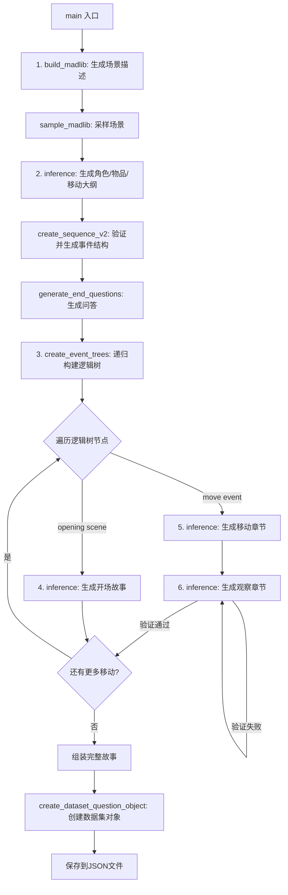

# Object Placements 任务 - LLM调用完整分析文档

> 自动生成文档，详细记录物品放置任务中所有大语言模型调用的信息

## 目录

1. [概述](#概述)
2. [LLM调用总览表](#llm调用总览表)
3. [详细调用分析](#详细调用分析)
4. [占位变量汇总](#占位变量汇总)
5. [调用流程图](#调用流程图)

---

## 概述

在生成一个物品放置题目时，代码会按顺序调用 LLM **至少 6 类调用点**。根据逻辑树深度和移动次数，实际调用次数约为 **12-24 次**。

### 调用统计

| 调用类型 | 调用次数 | 说明 |
|---------|---------|------|
| 场景生成 | 1 | build_madlib |
| 故事大纲 | 1 | 角色/物品/移动 |
| 逻辑树填充 | N | 取决于树深度（通常3-10次） |
| 开场故事 | 1 | opening scene |
| 移动章节 | 3 | 每个移动一次 |
| 观察章节 | 3-9 | 每个移动1-3次（含重试） |
| **总计** | **约 12-24 次** | 每个样本 |

---

## LLM调用总览表

| 序号 | 调用名称 | 目的 | 模型 | 调用次数 | 代码位置 |
|------|---------|------|------|---------|---------|
| 1 | 场景描述生成 (build_madlib) | 生成多个物品放置场景描述供后续采样，创建故事的基础背景... | GPT-4 | 1次 | L143-148 |
| 2 | 故事大纲生成 (角色/物品/移动序列) | 根据场景描述生成完整的故事大纲，包括3个角色、2个物品、3次... | GPT-4 | 1次 | L159-241 |
| 3 | 逻辑推理树填充 (create_event_trees → complete_structure) | 为每个'某人看到/没看到物品移动'的事实生成推理证明树，递归... | GPT-4 | N次 (取决于逻辑树深度和分支数，通常3-10次) | L377-396 |
| 4 | 开场故事生成 (Opening Scene) | 生成故事开场段落，介绍场景设定和物品初始位置，确保所有角色都... | GPT-4 | 1次 | L416-478 |
| 5 | 移动章节生成 (Move Chapter) | 为每次物品移动生成1-2句故事描述，描述移动动作本身... | GPT-4 | 3次 (每个移动调用一次) | L510-565 |
| 6 | 观察章节生成 (Observation Chapter) | 描述其他角色在移动发生时在做什么，解释为何他们看到或没看到移... | GPT-4 | 3-9次 (每个移动1次，验证失败可重试最多3次) | L588-667 |

---

## 详细调用分析

### 1. 场景描述生成 (build_madlib)

#### 基本信息

| 属性 | 内容 |
|------|------|
| **目的** | 生成多个物品放置场景描述供后续采样，创建故事的基础背景 |
| **文件路径** | `musr_dataset_scripts/create_object_placements.py` |
| **代码行号** | `L143-148 → src/dataset_builder.py L197-228` |
| **调用方法** | `creator.build_madlib() → self.inference(prompt, model)` |
| **使用模型** | `GPT-4 (model_to_use = gpt4)` |
| **调用次数** | 1次 |

#### 完整提示词模板

```
Create {max_n_creations} {things_to_create_description}

Here are some examples.

Output:
{example_str}

Your Turn.

Output:
```

#### 占位变量说明

| 变量名 | 来源 | 描述 |
|--------|------|------|
| `{max_n_creations}` | build_madlib参数, 默认值=200 | 要生成的场景数量 |
| `{things_to_create_description}` | build_madlib参数: things_to_create_description[0] | 场景描述的说明文字，值为: 'Create a scenario where a group of people are together and there is an item of great importance to at least one of those people. If this item is moved, and they don't know it has been moved, they could be negatively impacted. Do not number them, give the scenario separated by newlines only.' |
| `{example_str}` | examples_of_things_to_create参数，用'\n'.join()拼接 | ICL示例场景列表，用换行符连接 |

#### 字符串拼接逻辑

```python
# src/dataset_builder.py L220-222
for name, x, examples in zip(things_to_create_names, things_to_create_description, examples_of_things_to_create):
    example_str = '\n'.join(examples)
    prompt = f'Create {max_n_creations} {x}\n\nHere are some examples.\n\nOutput:\n{example_str}\n\nYour Turn.\n\nOutput:'
```

#### 备注

示例包括：'Sarah is making coffee at her work...', 'Aunt Mays medicine is always behind her mirror...', 'Evidence is imperative for a detective...'

---

### 2. 故事大纲生成 (角色/物品/移动序列)

#### 基本信息

| 属性 | 内容 |
|------|------|
| **目的** | 根据场景描述生成完整的故事大纲，包括3个角色、2个物品、3次移动的详细信息 |
| **文件路径** | `musr_dataset_scripts/create_object_placements.py` |
| **代码行号** | `L159-241` |
| **调用方法** | `creator.inference(prompt, model_to_use)` |
| **使用模型** | `GPT-4 (model_to_use = gpt4)` |
| **调用次数** | 1次 |

#### 完整提示词模板

```
You will build out an outline of a dramatic story given a short description of the scenario.  To do this, we are going to create three characters each with their own roles in the story and motivations.  

We will then set the scene.  We will determine what the three characters doing together (the goal of the story).

Then we will create a list of three "moves". A "move" involves one character moving an item from one location to a new location.  The items that are being moved should be smaller and tangible where as the locations should be places all the items could fit into.   For example, a shelf may be a location and an item may be a bag of coffee, this works out because a shelf can reasonably hold a bag of coffee.

For each of the three moves, we will say why someone is doing this and how it relates to the story.  Most importantly, the justification for doing something should not depend on other people in the story -- we want people to be doing their own activities and moving things around so we can later ask questions about the story and the characters observations in it for the reader.

Rules:
1) When describing characters make sure you are using real names and their roles fit given the description.
2) The motivation and location of the story should make sense given the characters and their roles.
3) The story outline should involve all three people working on something similar with one major plot point.  For example, making coffee for a customer.
4) The moves should make sense given the story thus far, the characters and their roles, and the location.  For example, a customer should not be moving milks around in a cafe because they don't work there.
5) For the moves, you must use tangible small items, do not use ideas "a performance" for example, do not use large items like "a tv".  Instead use small, easily moved items like "Iphone", "Notebook", "Laptop" etc.
6) The locations you pick must be able to house the items you made.  So if you said "Golf club" was an item, all locations must be able to fit a golf club in them, you would not say "coat pocket" for example.
7) Your justifications for why someone moved an item should involve the character moving the object only! You can include details about the story and location, but it should never involve another person (as this defeats our Question and Answer test for the reader later on).
8) Only two items may be introduced into the story, three people may be introduced, and four locations.  One person may move an item twice, but no more.
9) Locations should be general, for example say "from his desk to her shelf" do not say things like "from Carl's desk to Sarah's shelf" as this makes it difficult for us to parse out the locations from your output.
10) Follow the moves template exactly so our python program can parse it. The format is: "[persons name] moves the [item name] from the [from_location] to the [destination_location]."  Do not diverge from this format.

You cannot use any other items name in the justification for the move except for the item moving.  For example, if the items are "cards and apple", when justifying the move for the "cards" you cannot say "apple" in the justification.
There must always be two unique items.

Here's an example

Description: Sarah is making coffee at her work, she wants to use almond milk for her customer.

Output:

Character 1
Name: Sarah
Role: The Barista
Motivation: Sarah wants to make Luis an almond milk coffee.

Character 2
Name: Luis
Role: A customer
Motivation: Luis is having a rough week with deadlines looming over him, so he wanted his favorite coffee with almond milk.

Character 3
Name: John
Role: A cafe worker
Motivation: John is having his first day working at the coffee cafe, he is working hard to make sure all the tables are clean for the customers.

Story outline:
Luis was having a super hard week with his paper deadline approaching and with all his experiments now failing he was in desperate need of his favorite cup of jo, with a dash of almond milk.  He ordered it from Sarah who is about to start making it.  Sarah is a skilled barista and has worked there for awhile, she loves making her customers feel welcomed.  However, John is new and constantly fumbling around with things (which is expected since he's new).  To keep him busy, Sarah put him on cleaning duty.

Moves:

Move 1 - Luis moves the almond milk from the fridge to the back shelves.
Mover: Luis
Item: almond milk
From: fridge
To: back shelves
Reason - Luis is cleaning the fridge so everyone can work more efficiently.

Move 2 - Sarah moves the coffee bag from the back shelves to the front counter.
Mover: Sarah
Item: coffee bag
From: back shelves
To: front counter
Reason - Sarah ran out of beans for making coffee and had to go back to get the spare.

Move 3 - Sarah moves the almond milk from the back shelves to the fridge.
Mover: Sarah
Item: almond milk
From: bach shelves
To: fridge
Reason - She noticed the milk was left out for too long and put it back before it spoiled.

Your turn!

Description: {description}

Output:

```

#### 占位变量说明

| 变量名 | 来源 | 描述 |
|--------|------|------|
| `{description}` | sample_madlib()返回的descriptions[0] | 从build_madlib生成的场景中采样得到的场景描述 |

#### 字符串拼接逻辑

```python
# musr_dataset_scripts/create_object_placements.py L151-152, L159-236
descriptions, _, previous_samples = creator.sample_madlib(madlib, ['scenario_descriptions'], '{scenario_descriptions}', previously_sampled=previous_samples)
description = descriptions[0]

prompt = f'''
You will build out an outline of a dramatic story...
...
Description: {description}

Output:
'''.strip()
```

#### 备注

输出需要严格遵循格式以便后续解析：Character 1/2/3、Story outline、Move 1/2/3

---

### 3. 逻辑推理树填充 (create_event_trees → complete_structure)

#### 基本信息

| 属性 | 内容 |
|------|------|
| **目的** | 为每个'某人看到/没看到物品移动'的事实生成推理证明树，递归填充逻辑树节点 |
| **文件路径** | `musr_dataset_scripts/create_object_placements.py → src/dataset_types/object_placements_dataset.py → src/dataset_builder.py` |
| **代码行号** | `L377-396 → L253-343 → L330-460 → L508-611` |
| **调用方法** | `creator.create_event_trees() → self.complete_structure() → iteratively_complete_v2() → model.inference(prompt)` |
| **使用模型** | `GPT-4 (model_to_use = gpt4)` |
| **调用次数** | N次 (取决于逻辑树深度和分支数，通常3-10次) |

#### 完整提示词模板

```
【Intro部分 - __object_placements_completion_intro__】
We are creating a story where people are going to move a lot of items many times.  The goal of the story is to be interesting and unique but also have a clear tracking of where objects are so we can quiz readers and language models later on about the world state and about who knows what.

To make this story, we've created a tree structure that outlines the narrative and updates to the world.  Your job is to fill out the entailment trees that prove a person saw or did not see an event happen.

An entailment tree is a tree structure where intermediate nodes are entailed by their children.  They create a natural language reasoning proof for some collection of facts.


To fill out this tree we need to complete an entailment. Completing an entailment is akin to filling out one subtree of the entailment tree. To fill in this step, you must follow the structure of the step.

Facts From Story are facts that will be explicitly stated when we write the story.
Commonsense Knowledge are facts that most people would agree are true and don't need to be explicitly said.
Complex Facts are facts that will be entailed by simpler facts from the story (they will be filled in later through a recursive call back to you!)

All facts for the step must combine to entail the root parent fact.

No facts may contradict the current structure tree.  

Do not include facts about other people, focus on the facts for the person who is seeing or not seeing something move.

Always match the exact structure of the entailment step I give you.  Give the same number of Facts From Story and Commonsense Knowledge facts.  Give them in the same order as well.

Never explicitly say someone didn't see something or did see something.  Your job is to provide facts that suggest this.  For example, if May saw Greg move something, we might say "May was watching Greg while doing her chores", and that "by watching someone, you are seeing what they are doing".  Notice we describe the physics of seeing something, but we don't outright say that someone saw something.

Never mention an item being moved or reuse an item.  For example, if theres a fact like "Greg didn't see his iphone" and you are proving why "Joel didn't see the apple move", never reuse Greg's iphone in your facts.  Our program strictly controls where items are placed, we don't want you introducing item placements we haven't accounted for.

Each fact should be crucial to the deduction.  Intentionally leave out details so that the other facts can account for them.  If one fact is missing, the conclusion should not be entailed.  Try not to reuse the same facts.

Always use the persons name instead of a pronoun like "He" or "She", if you know someones name, use the name.

Only perform one deduction at a time.  Your deduction should match the "Entailment Step to Complete" template exactly so we can parse it later on.

【ICL示例部分】
Here's an example.

Scenario: 
{example_description}

Current Tree:
{example_tree_str}

Entailment Step to complete:
{example_node_str}

Output:
{example_completion_str}

【实际任务部分】
Your Turn.

Scenario: {completion_description}

Current Tree:
{current_tree_state}

Entailment Step to Complete:
{node_to_complete} Because in the story we find out,
> Fact From Story
> Commonsense Knowledge

Output:
```

#### 占位变量说明

| 变量名 | 来源 | 描述 |
|--------|------|------|
| `{example_description}` | example_descriptions列表，代码L48: 'Paul and Alice are at a karaoke bar.' | ICL示例的场景描述 |
| `{example_tree_str}` | example_trees[i].print_for_gpt() | ICL示例的完整逻辑树结构 |
| `{example_node_str}` | node_str(example_node, ...) | ICL示例中要完成的节点结构 |
| `{example_completion_str}` | node_str(example_node, completed=True, ...) | ICL示例的完成结果 |
| `{completion_description}` | create_event_trees参数，包含story_desc和角色信息 | 当前故事的详细描述，包含角色名称、角色、动机 |
| `{current_tree_state}` | tree.print_for_gpt() | 当前逻辑树的完整状态 |
| `{node_to_complete}` | node_str(node, ...) | 当前需要填充的节点及其父节点路径 |

#### 字符串拼接逻辑

```python
# src/dataset_builder.py L34-185 (__create_completion_prompt__)
def __create_completion_prompt__(example_trees, example_nodes, example_descriptions, intro, pad_char, because_clause_after, because_clause, use_complex_facts):
    # 构建ICL示例字符串
    ex_strs = []
    for (example_tree, example_node, example_description) in zip(example_trees, example_nodes, example_descriptions):
        example_tree_str = example_tree.print_for_gpt(pad_space=1, pad_char=pad_char)
        example_node_str = node_str(example_node, ...)
        example_completion_str = node_str(example_node, completed=True, ...)
        ex_strs.append(f'''
Scenario: 
{example_description}

Current Tree:
{example_tree_str}

Entailment Step to complete:
{example_node_str}

Output:
{example_completion_str}
        '''.strip())
    
    ex_str = "\nHere is another example.\n\n".join(ex_strs)
    
    # 返回partial函数
    def prompt(tree, node, description, ex_str, _intro, pad_char):
        return f'''
{_intro}

Here's an example.

{ex_str}

Your Turn.

Scenario: {description}

Current Tree:
{tree.print_for_gpt(...)}

Entailment Step to Complete:
{node_str(node, ...)}

Output:
        '''.strip()
    
    return partial(prompt, ex_str=ex_str, _intro=intro, pad_char=pad_char)

# src/dataset_types/object_placements_dataset.py L329-334
completion_prompt_fn=self.create_completion_prompt(
    example_completion_trees, example_completion_nodes, example_completion_descriptions,
    intro=__object_placements_completion_intro__,
    because_clause_after=0,
    because_clause='Because in the story we find out,',
    use_complex_facts=use_complex_facts
)
```

#### 备注

这是递归调用，每个需要填充的逻辑树节点都会调用一次LLM。使用ForbiddenTextValidator验证输出不能包含物品名和位置名。

---

### 4. 开场故事生成 (Opening Scene)

#### 基本信息

| 属性 | 内容 |
|------|------|
| **目的** | 生成故事开场段落，介绍场景设定和物品初始位置，确保所有角色都知道物品位置 |
| **文件路径** | `musr_dataset_scripts/create_object_placements.py` |
| **代码行号** | `L416-478` |
| **调用方法** | `creator.inference(opening_prompt, model_to_use)` |
| **使用模型** | `GPT-4 (model_to_use = gpt4)` |
| **调用次数** | 1次 |

#### 完整提示词模板

```
Create an opening scene description for a story.  It will be short.  Only write about the objects we list out and their location.  Your story MUST include each item and their location from the list.  Your story also MUST indicate that all the people we give you saw the location of all these items!

You may use the description to infer the correct scenery to describe, but are only allowed to talk about the facts presented in the list.

You must state that everyone knows where everything is, "They were all aware of each items location" or something like that is a safe way to ensure this condition is met.  Try to make this coherent with the story though.  For example, if someone doesn't know the exact location you could say "Everyone was aware that the item was somewhere in the location, and they definitely all knew that the other item was in the other location", or something like this.

Here is an example.

Description: Alex is making Ramen and needs the noodles to cook.

Items and Locations:
- The pans are at the stove.
- The noodles are at the fridge.
- The kitchen knife is at the table.

Character 1:
Name: Alex
Role in story: A want to be chef
Motivation in story: To make a bowl of ramen.

Character 2:
Name: Carol
Role in story: the roommate
Motivation in story: Hanging out with Alex, she is also hungry.

Character 3:
Name: Joshua
Role in story: A random visitor
Motivation in story: Joshua was a friend of Alex but showed up unannounced and hungry.

Output: Alex and Carol were having a peaceful evening hanging out.  Both getting a bit peckish, they decided to eat some ramen, which Alex had been practicing making for awhile now. Everyone knew Alex was the "Chef Friend", meaning that he was always cooking something delicious up. In fact, that's why a hungry friend, who showed up unannounced, Joshua decided to show up.  All three of them noticed that the pans were already on the stove, perfect for ramen making! The kitchen knife was on the table, and the noodles were in the fridge.

Your turn.

Description: {story_desc}

Items and Locations:
{facts_str}

Character 1:
Name: {people_data[0]['name']}
Role in story: {people_data[0]["role"]}
Motivation in story: {people_data[0]["motivation"]}

Character 2:
Name: {people_data[1]['name']}
Role in story: {people_data[1]["role"]}
Motivation in story: {people_data[1]["motivation"]}


Character 3:
Name: {people_data[2]['name']}
Role in story: {people_data[2]["role"]}
Motivation in story: {people_data[2]["motivation"]}

Output:
```

#### 占位变量说明

| 变量名 | 来源 | 描述 |
|--------|------|------|
| `{story_desc}` | LLM调用#2解析得到的lines[3] | 故事大纲描述 |
| `{facts_str}` | actual_locs[0].items() 格式化 | 物品初始位置列表，格式: '- the {item} is at the {location}' |
| `{people_data[i]['name']}` | LLM调用#2解析得到的角色名称 | 第i+1个角色的名称 |
| `{people_data[i]['role']}` | LLM调用#2解析得到的角色身份 | 第i+1个角色的身份/职业 |
| `{people_data[i]['motivation']}` | LLM调用#2解析得到的角色动机 | 第i+1个角色的动机 |

#### 字符串拼接逻辑

```python
# musr_dataset_scripts/create_object_placements.py L414, L416-473
facts_str = '\n'.join([
    f'- {respect_article(respect_plural(x), people)} at {respect_article(y, people)}' 
    for x, y in actual_locs[0].items()
])

opening_prompt = f"""
Create an opening scene description for a story...
...
Description: {story_desc}

Items and Locations:
{facts_str}

Character 1:
Name: {people_data[0]['name']}
Role in story: {people_data[0]["role"]}
Motivation in story: {people_data[0]["motivation"]}
...
Output:
""".strip()
```

#### 备注

respect_article()函数为物品添加'the'冠词，respect_plural()处理复数形式

---

### 5. 移动章节生成 (Move Chapter)

#### 基本信息

| 属性 | 内容 |
|------|------|
| **目的** | 为每次物品移动生成1-2句故事描述，描述移动动作本身 |
| **文件路径** | `musr_dataset_scripts/create_object_placements.py` |
| **代码行号** | `L510-565` |
| **调用方法** | `creator.inference(move_prompt, model_to_use)` |
| **使用模型** | `GPT-4 (model_to_use = gpt4)` |
| **调用次数** | 3次 (每个移动调用一次) |

#### 完整提示词模板

```
You are going to continue our story that we have written by writing a short description of this event that will happen next.  Only write about the move, do not add any additional information.

Never say "someone didn't see something" or infer someones ability to infer where something is.  Never say "Unbeknownst" or anything like this!
Here is an example.

Only write one or two sentences.  It should be a very short continuation.

Description: Timmy was angry at Bob for cheating his way into the job Timmy deserved! So he started throwing away Bobs possessions.

Character:
Name: Timmy
Role in story: A recent graduate who is sharing an apartment.
Motivation in story: Timmy is angry because he interviewed for a job that his roommate got, but only because he cheated.

Event:
- Timmy moves the car keys to the trash bin. Because, Timmy was angry with Bob and wanted to throw away his keys.
- Timmy saw the iphone at the trash bin when moving the car keys.

Output: With an angry thrust, the keys clanked against the tin trash bin.  An unexpected *smack* followed though... curiosity overtaking his anger, Timmy looked in the trash and saw the iphone in there as well.

Here is another example.

Description: Carol had just moved into her new apartment, but, the previous tenant made a huge mess! The landlord wouldn't do anything, so it looks like she has to clean it all up herself.

Character:
Name: Carol
Role in story: Just moved into a new messy apartment.
Motivation in story: Carol wants to clean her new apartment that was left a mess by the previous tenant and has exactly no help from management.

Event:
- Carol moves the noodles to the pantry. Because, Carol was excited to have a clean apartment finally, and the noodles were the last step!

Output: Carol excitingly places the noodles back into the pantry.  What was once thought of as a never ending onslaught of trash and random items finally concluded and the apartment was finally clean again!

Your turn.

Description: {story_desc}

Character:
Name: {moving_character['name']}
Role in story: {moving_character["role"]}
Motivation in story: {moving_character["motivation"]}

Event:
{facts_str}

Output:
{story_so_far}
```

#### 占位变量说明

| 变量名 | 来源 | 描述 |
|--------|------|------|
| `{story_desc}` | LLM调用#2解析得到的故事大纲 | 故事大纲描述 |
| `{moving_character['name']}` | people_data中匹配当前移动者的角色 | 执行移动的角色名称 |
| `{moving_character['role']}` | people_data中匹配当前移动者的角色身份 | 执行移动的角色身份 |
| `{moving_character['motivation']}` | people_data中匹配当前移动者的角色动机 | 执行移动的角色动机 |
| `{facts_str}` | [n.value, *children] 格式化 | 移动事件列表，包含移动动作和可能看到的其他物品 |
| `{story_so_far}` | 累积的故事文本 | 到目前为止生成的故事内容，用于续写 |

#### 字符串拼接逻辑

```python
# musr_dataset_scripts/create_object_placements.py L494-559
children = [x for x in n.children if 'when moving' in x.value]
facts = [n.value, *children]  # 移动事件 + 移动时看到的物品
facts_str = "\n".join([f'- {x}' for x in facts])

moving_character = [x for x in people_data if x['name'] == facts[0].split(' ')[0]][0]

move_prompt = f"""
You are going to continue our story...
...
Description: {story_desc}

Character:
Name: {moving_character['name']}
Role in story: {moving_character["role"]}
Motivation in story: {moving_character["motivation"]}

Event:
{facts_str}

Output:
{story_so_far}
""".strip()
```

#### 备注

story_so_far作为上下文传入，让LLM续写故事。每次移动后story_so_far会累加新内容。

---

### 6. 观察章节生成 (Observation Chapter)

#### 基本信息

| 属性 | 内容 |
|------|------|
| **目的** | 描述其他角色在移动发生时在做什么，解释为何他们看到或没看到移动 |
| **文件路径** | `musr_dataset_scripts/create_object_placements.py` |
| **代码行号** | `L588-667` |
| **调用方法** | `creator.inference(obs_prompt, model_to_use)` |
| **使用模型** | `GPT-4 (model_to_use = gpt4)` |
| **调用次数** | 3-9次 (每个移动1次，验证失败可重试最多3次) |

#### 完整提示词模板

```
Continue the story we have written so far by writing about the observational facts below. Only write about the facts and do not add new information.  Never say "Someone saw" or "Did not notice" and never indicate if someone sees something, unless the only fact you have is "someone sees X".

Stick to the facts, there will be more information about the story that you can use to set the tone, but you should always use the facts as the main guide for the story.

Never mention the key items in the story:
{items_str}

{continuation_instruction}

Your story should take place during the most recent move.  So while this is happening:

"{output}"

the facts you will be writing about are happening at the same time.

Here is an example.

Description: Jerry, Marry and Timmy are getting ready for the day.  Jerry has a huge meeting that he needs to prep for.  Marry is excited to help Jerry for his meeting and to hear about it later that day.  Timmy was getting ready for his test, but is being a bit inconsiderate to his dad, Jerry, with respect to his big meeting.

Character 1:
Name: Jerry
Role in story: the husband
Motivation in story: Jerry had a huge meeting coming up, one that could decide the fate of his career.

Character 2:
Name: Marry
Role in story: the wife
Motivation in story: Marry is always super supportive and wants the best for her family.

Character 3:
Name: Timmy
Role in story: the son
Motivation in story: Timmy has a huge test coming up in his school which he is nervous for and accidentally makes him a bit inconsiderate to everyone else.

Observational Facts:
- Jerry is cooking breakfast
- The trash bin is not in the kitchen.
- Marry is outside watering her garden.
- Marry has a window into the room with the trash bin.

Output: Jerry was hungry before he starts his day, so he was cooking his breakfast.  The kitchen turned out to not have the trash bin though.  Marry, always with her green thumb, was watering her garden and could see the trash bin through a nearby window.  

Your turn.

Description: {story_desc}

Character 1:
Name: {people_data[0]['name']}
Role in story: {people_data[0]["role"]}
Motivation in story: {people_data[0]["motivation"]}

Character 2:
Name: {people_data[1]['name']}
Role in story: {people_data[1]["role"]}
Motivation in story: {people_data[1]["motivation"]}

Character 3:
Name: {people_data[2]['name']}
Role in story: {people_data[2]["role"]}
Motivation in story: {people_data[2]["motivation"]}

Observational Facts:
{obs_facts_str}

Output:
{story_so_far}
```

#### 占位变量说明

| 变量名 | 来源 | 描述 |
|--------|------|------|
| `{items_str}` | items列表格式化: '\n'.join([f'- {x}' for x in items]) | 禁止提及的物品列表 |
| `{continuation_instruction}` | 条件判断: 是否是最后一个移动 | 如果不是最后一个移动: 'There will be another event after this paragraph, so end this paragraph abruptly...'; 如果是最后一个: 'This is the end of the story, write a concluding sentence after your paragraph.' |
| `{output}` | LLM调用#5的输出 | 最近一次移动章节的输出，提供时间上下文 |
| `{story_desc}` | LLM调用#2解析得到的故事大纲 | 故事大纲描述 |
| `{people_data[i][...]}` | LLM调用#2解析得到的角色信息 | 角色信息 |
| `{obs_facts_str}` | stree.get_facts() 格式化 | 观察事实列表，来自逻辑树 |
| `{story_so_far}` | 累积的故事文本 | 到目前为止生成的故事内容 |

#### 字符串拼接逻辑

```python
# musr_dataset_scripts/create_object_placements.py L578-667
# 获取观察事实
stree = copy.deepcopy(tree)
stree.nodes = [n]
stree.nodes[0].children = []
for p in paras:
    if len(p.children) > 0:
        stree.nodes[0].children.extend(p.children)
    else:
        stree.nodes[0].children.append(p)

obs_facts = stree.get_facts()
obs_facts_str = "\n".join(sorted([f'- {x.value}' for x in obs_facts]))

# 构建continuation_instruction
continuation_instruction = (
    "There will be another event after this paragraph, so end this paragraph abruptly sticking only with the facts.  Make no general statements. The last sentence should be something about the facts we listed out only. It should be a complete sentence."
    if loop_idx < len(tree.nodes[0].children) - 1 else
    "This is the end of the story, write a concluding sentence after your paragraph."
)

obs_prompt_beginning = f"""
Continue the story we have written so far...
...
Observational Facts:
{obs_facts_str}
""".strip()

output_obs_prompt = f'''
Output:
{story_so_far}
'''

# 重试逻辑
while obs_retry < 3:
    obs_output, _ = creator.inference(f'{obs_prompt_beginning}\n\n{output_obs_prompt}', model_to_use)
    
    # 验证：不能包含关键物品名称
    if any([x.lower() in obs_output.lower() for x in items]):
        obs_prompt_beginning += f"\n\nOne of your last outputs was this: \n\n{obs_output}\n\nThis is incorrect because it mentions one of our key items: \n{items_str}\n\nMake sure your next generation does not include mentioning our key items as that can confuse the reader."
        obs_retry += 1
    else:
        break
```

#### 备注

包含验证逻辑：输出不能包含关键物品名称，否则会重试并将错误信息添加到prompt中

---

## 占位变量汇总

以下是所有提示词中使用的占位变量的完整列表：

| 变量名 | 所属调用 | 来源 | 描述 |
|--------|---------|------|------|
| `{max_n_creations}` | 1. 场景描述生成 | build_madlib参数, 默认值=200... | 要生成的场景数量... |
| `{things_to_create_description}` | 1. 场景描述生成 | build_madlib参数: things_to_create_descrip... | 场景描述的说明文字，值为: 'Create a scenario where a... |
| `{example_str}` | 1. 场景描述生成 | examples_of_things_to_create参数，用'\n'.joi... | ICL示例场景列表，用换行符连接... |
| `{description}` | 2. 故事大纲生成 | sample_madlib()返回的descriptions[0]... | 从build_madlib生成的场景中采样得到的场景描述... |
| `{example_description}` | 3. 逻辑推理树填充 | example_descriptions列表，代码L48: 'Paul and ... | ICL示例的场景描述... |
| `{example_tree_str}` | 3. 逻辑推理树填充 | example_trees[i].print_for_gpt()... | ICL示例的完整逻辑树结构... |
| `{example_node_str}` | 3. 逻辑推理树填充 | node_str(example_node, ...)... | ICL示例中要完成的节点结构... |
| `{example_completion_str}` | 3. 逻辑推理树填充 | node_str(example_node, completed=True, .... | ICL示例的完成结果... |
| `{completion_description}` | 3. 逻辑推理树填充 | create_event_trees参数，包含story_desc和角色信息... | 当前故事的详细描述，包含角色名称、角色、动机... |
| `{current_tree_state}` | 3. 逻辑推理树填充 | tree.print_for_gpt()... | 当前逻辑树的完整状态... |
| `{node_to_complete}` | 3. 逻辑推理树填充 | node_str(node, ...)... | 当前需要填充的节点及其父节点路径... |
| `{story_desc}` | 4. 开场故事生成 | LLM调用#2解析得到的lines[3]... | 故事大纲描述... |
| `{facts_str}` | 4. 开场故事生成 | actual_locs[0].items() 格式化... | 物品初始位置列表，格式: '- the {item} is at the {lo... |
| `{people_data[i]['name']}` | 4. 开场故事生成 | LLM调用#2解析得到的角色名称... | 第i+1个角色的名称... |
| `{people_data[i]['role']}` | 4. 开场故事生成 | LLM调用#2解析得到的角色身份... | 第i+1个角色的身份/职业... |
| `{people_data[i]['motivation']}` | 4. 开场故事生成 | LLM调用#2解析得到的角色动机... | 第i+1个角色的动机... |
| `{story_desc}` | 5. 移动章节生成 | LLM调用#2解析得到的故事大纲... | 故事大纲描述... |
| `{moving_character['name']}` | 5. 移动章节生成 | people_data中匹配当前移动者的角色... | 执行移动的角色名称... |
| `{moving_character['role']}` | 5. 移动章节生成 | people_data中匹配当前移动者的角色身份... | 执行移动的角色身份... |
| `{moving_character['motivation']}` | 5. 移动章节生成 | people_data中匹配当前移动者的角色动机... | 执行移动的角色动机... |
| `{facts_str}` | 5. 移动章节生成 | [n.value, *children] 格式化... | 移动事件列表，包含移动动作和可能看到的其他物品... |
| `{story_so_far}` | 5. 移动章节生成 | 累积的故事文本... | 到目前为止生成的故事内容，用于续写... |
| `{items_str}` | 6. 观察章节生成 | items列表格式化: '\n'.join([f'- {x}' for x in... | 禁止提及的物品列表... |
| `{continuation_instruction}` | 6. 观察章节生成 | 条件判断: 是否是最后一个移动... | 如果不是最后一个移动: 'There will be another event... |
| `{output}` | 6. 观察章节生成 | LLM调用#5的输出... | 最近一次移动章节的输出，提供时间上下文... |
| `{story_desc}` | 6. 观察章节生成 | LLM调用#2解析得到的故事大纲... | 故事大纲描述... |
| `{people_data[i][...]}` | 6. 观察章节生成 | LLM调用#2解析得到的角色信息... | 角色信息... |
| `{obs_facts_str}` | 6. 观察章节生成 | stree.get_facts() 格式化... | 观察事实列表，来自逻辑树... |
| `{story_so_far}` | 6. 观察章节生成 | 累积的故事文本... | 到目前为止生成的故事内容... |

---

## 调用流程图



---

## 核心代码引用

### 主入口文件
- `musr_dataset_scripts/create_object_placements.py` - 主脚本
- `src/dataset_types/object_placements_dataset.py` - 数据集类
- `src/dataset_builder.py` - 基础构建器

### 关键函数
1. `DatasetBuilder.build_madlib()` - 生成场景
2. `DatasetBuilder.inference()` - LLM调用封装
3. `DatasetBuilder.complete_structure()` - 逻辑树填充
4. `DatasetBuilder.iteratively_complete_v2()` - 递归填充算法
5. `ObjectPlacementsDataset.create_event_trees()` - 事件树创建

---

*文档由 `extract_llm_calls_object_placements.py` 自动生成*
