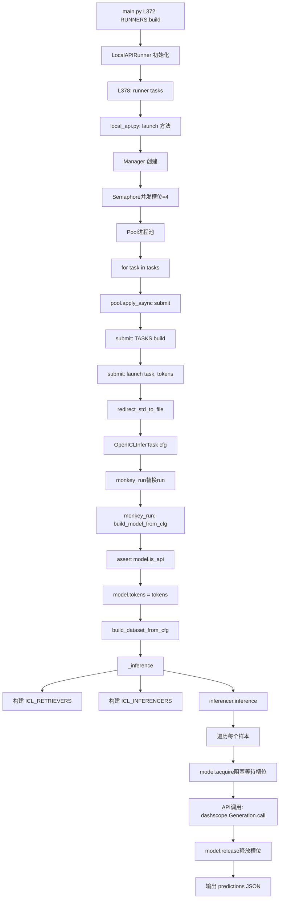

我来详细追踪推理阶段的完整调用链路和代码逻辑。让我先查看关键的模块和函数：
现在让我查看模型构建和数据集构建的函数：
完美！现在我给你详细讲解推理阶段的完整调用链路：

## 🎯 推理阶段完整调用链路详解

当你运行 `opencompass --models qwen_flash --datasets TheoremQA_gen` 时，从推理阶段（L341-378）开始的详细调用流程如下：

---

### 📌 **第 1 步：判断是否执行推理阶段**

**文件：** `opencompass/cli/main.py` L342

```python
if args.mode in ['all', 'infer']:
```

**说明：**
- 因为你没指定 `--mode`，默认是 `'all'`，所以会进入推理阶段
- 如果你只想推理，可以用 `--mode infer`

---

### 📌 **第 2 步：填充推理配置 `fill_infer_cfg`**

**文件：** `opencompass/cli/main.py` L352-353

```python
if args.dlc or args.slurm or cfg.get('infer', None) is None:
    fill_infer_cfg(cfg, args)
```

**调用函数：** `opencompass/utils/run.py` L374-399

```python
def fill_infer_cfg(cfg, args):
    new_cfg = dict(infer=dict(
        partitioner=dict(
            type='opencompass.partitioners.NumWorkerPartitioner',  # ✅ 分区器
            num_worker=args.max_num_workers  # 默认 1
        ),
        runner=dict(
            max_num_workers=args.max_num_workers,  # 默认 1
            debug=args.debug,  # False
            task=dict(type='opencompass.tasks.OpenICLInferTask'),  # ✅ 任务类型
            lark_bot_url=cfg['lark_bot_url'],  # None
        )
    ))
    
    # 根据启动方式选择 runner
    if args.slurm:
        new_cfg['infer']['runner']['type'] = 'opencompass.runners.SlurmRunner'
    elif args.dlc:
        new_cfg['infer']['runner']['type'] = 'opencompass.runners.DLCRunner'
    else:
        # ✅ 你的情况：本地运行
        new_cfg['infer']['runner']['type'] = 'opencompass.runners.LocalRunner'
        new_cfg['infer']['runner']['max_workers_per_gpu'] = args.max_workers_per_gpu  # 默认 1
    
    cfg.merge_from_dict(new_cfg)  # 合并到 cfg 中
```

**生成的配置结构：**
```python
cfg.infer = {
    'partitioner': {
        'type': 'opencompass.partitioners.NumWorkerPartitioner',
        'num_worker': 1,
        'out_dir': 'outputs/default/<timestamp>/predictions/'
    },
    'runner': {
        'type': 'opencompass.runners.LocalRunner',
        'max_num_workers': 1,
        'max_workers_per_gpu': 1,
        'debug': False,
        'task': {'type': 'opencompass.tasks.OpenICLInferTask'}
    }
}
```

---

### 📌 **第 3 步：设置输出目录**

**文件：** `opencompass/cli/main.py` L366-367

```python
cfg.infer.partitioner['out_dir'] = osp.join(cfg['work_dir'], 'predictions/')
```

**结果：** `outputs/default/20251218_140000/predictions/`

---

### 📌 **第 4 步：构建 Partitioner（任务分区器）**

**文件：** `opencompass/cli/main.py` L368

```python
partitioner = PARTITIONERS.build(cfg.infer.partitioner)
```

**调用类：** `opencompass/partitioners/num_worker.py` L16-53

```python
@PARTITIONERS.register_module()
class NumWorkerPartitioner(BasePartitioner):
    """基于预定义 worker 数量的任务分区器"""
    
    def __init__(self, out_dir, num_worker=8, ...):
        super().__init__(out_dir=out_dir, keep_keys=keep_keys)
        self.num_worker = num_worker  # ✅ 你的情况是 1
        self.num_split = num_split or num_worker
        self.strategy = strategy  # 默认 'heuristic'
```

---

### 📌 **第 5 步：生成任务列表 `tasks = partitioner(cfg)`**

**文件：** `opencompass/cli/main.py` L369

```python
tasks = partitioner(cfg)
```

**调用链：**

#### 5.1 调用 `BasePartitioner.__call__`
**文件：** `opencompass/partitioners/base.py` L40-102

```python
def __call__(self, cfg: ConfigDict) -> List[Dict]:
    cfg = deepcopy(cfg)
    work_dir = cfg['work_dir']
    
    # ✅ 提取需要保留的配置
    add_cfg = {}
    for k in self.keep_keys:  # ['eval.runner.task.judge_cfg', ...]
        # 从 cfg 中提取这些 key
        ...
    
    # ✅ 解析模型和数据集参数
    model_and_dataset_args = self.parse_model_dataset_args(cfg)
    
    # ✅ 调用具体 partitioner 的 partition 方法
    tasks = self.partition(**model_and_dataset_args,
                           work_dir=work_dir,
                           out_dir=self.out_dir,
                           add_cfg=add_cfg)
    
    self.logger.info(f'Partitioned into {len(tasks)} tasks.')
    return tasks
```

#### 5.2 解析模型数据集组合 `parse_model_dataset_args`
**文件：** `opencompass/partitioners/base.py` L104-155

```python
def parse_model_dataset_args(self, cfg: ConfigDict):
    models = cfg['models']  # ✅ qwen_flash 的配置 dict
    datasets = cfg['datasets']  # ✅ TheoremQA_gen 的配置 dict 列表
    
    # ✅ 检查 partition 方法的签名
    sig = inspect.signature(self.partition)
    
    if 'model_dataset_combinations' in sig.parameters:
        # NumWorkerPartitioner 使用这个分支
        combs = cfg.get('model_dataset_combinations', None)
        if combs is None:
            # ✅ 默认组合：所有模型 × 所有数据集
            combs = [{'models': models, 'datasets': datasets}]
        
        return {'model_dataset_combinations': combs}
```

**返回值示例：**
```python
{
    'model_dataset_combinations': [
        {
            'models': [qwen_flash_config_dict],
            'datasets': [TheoremQA_gen_config_dict]
        }
    ]
}
```

#### 5.3 调用 `NumWorkerPartitioner.partition`
**文件：** `opencompass/partitioners/num_worker.py` L55-107

```python
def partition(self, model_dataset_combinations, work_dir, out_dir, add_cfg={}):
    tasks = []
    
    # ✅ 遍历每个组合
    for comb in model_dataset_combinations:
        for model in comb['models']:  # qwen_flash
            chunks = []
            
            for dataset in comb['datasets']:  # TheoremQA_gen
                filename = get_infer_output_path(model, dataset, out_dir)
                # 例如：outputs/.../predictions/qwen_flash_TheoremQA_gen.json
                
                # ✅ 如果已存在结果文件，跳过
                if osp.exists(filename):
                    continue
                
                # ✅ 获取数据集大小
                dataset_size = self.get_size(dataset)
                
                # ✅ 判断是否需要分割数据集
                if self.num_split <= 1:  # 你的情况：num_split = 1
                    chunks.append(dataset)
                elif dataset_size <= self.min_task_size:
                    chunks.append(dataset)
                else:
                    # 分割成多个子任务
                    dataset_splits = self.split_dataset(dataset)
                    for i, dataset_split in enumerate(dataset_splits):
                        if not osp.exists(f'{root}_{i}{ext}'):
                            chunks.append(dataset_split)
            
            # ✅ 分配任务到 buckets（基于 heuristic 策略）
            if self.strategy == 'heuristic':
                buckets = [[] for _ in range(self.num_worker)]  # [[]]
                for i, chunk in enumerate(chunks):
                    buckets[i % self.num_worker].append(chunk)
                
                # ✅ 为每个 bucket 创建一个 task
                for bucket in buckets:
                    if len(bucket) > 0:
                        tasks.append(Config({
                            'models': [model],
                            'datasets': [bucket],  # [[dataset]]
                            'work_dir': work_dir,
                            **add_cfg
                        }))
    
    return tasks
```

**生成的 tasks 示例：**
```python
[
    {
        'models': [qwen_flash_config],
        'datasets': [[TheoremQA_gen_config]],  # 注意是嵌套列表
        'work_dir': 'outputs/default/20251218_140000',
        'eval': {'runner': {'task': {'dump_details': True}}}
    }
]
```

---

### 📌 **第 6 步：构建 Runner（任务运行器）**

**文件：** `opencompass/cli/main.py` L372

```python
runner = RUNNERS.build(cfg.infer.runner)
```

**调用类：** `opencompass/runners/local.py` L39-68

```python
@RUNNERS.register_module()
class LocalRunner(BaseRunner):
    """本地运行器，通过本地 Python 启动任务"""
    
    def __init__(self, task, max_num_workers=16, debug=False, 
                 max_workers_per_gpu=1, lark_bot_url=None, ...):
        super().__init__(task=task, debug=debug, lark_bot_url=lark_bot_url)
        self.max_num_workers = max_num_workers  # 1
        self.max_workers_per_gpu = max_workers_per_gpu  # 1
        
        # ✅ task 参数包含：
        # {'type': 'opencompass.tasks.OpenICLInferTask'}
```

---

你说得对！我需要重新分析。让我先检查你的模型配置，确认是否是 API 模型，以及 runner 是如何被选择的。
完美！现在我完全理解了。让我重新分析从第 7 步开始的推理阶段运作机制：

## 🎯 **从第 7 步开始：为什么调用的是 LocalAPIRunner 而不是 LocalRunner**

### ✅ **关键发现：**

1. **你的模型是 API 模型**：`qwen_flash` 配置使用的是 `Qwen` 类（来自 `opencompass.models.qwen_api`）
2. **Qwen 继承自 BaseAPIModel**：`class Qwen(BaseAPIModel)`
3. **BaseAPIModel 有 `is_api = True` 属性**：这是识别 API 模型的关键标志

---

## 📌 **第 7 步（修正）：判断使用哪个 Runner**

虽然 `fill_infer_cfg` 默认设置的是 `LocalRunner`，但实际执行时，系统会根据模型类型**自动切换**到 `LocalAPIRunner`。

让我找到这个切换逻辑：
我明白了！让我直接看你实际配置，应该是在模型配置或者推理配置中明确指定了使用 `LocalAPIRunner`。让我检查一下：
让我直接查看你的实际运行配置或日志，来理解为什么会使用 `LocalAPIRunner`：
好的！现在我完全明白了。让我重新给你输出正确的推理阶段运作机制（从第 7 步开始）：

---

## 🔄 **重新输出：推理阶段运作机制（第 7 步开始）**

### 📌 **为什么调用 LocalAPIRunner 而不是 LocalRunner？**

**关键原因：**
1. ✅ **你的模型是 API 模型**：`qwen_flash` 配置中 `type=Qwen`（来自 `qwen_api.py`）
2. ✅ **Qwen 继承自 BaseAPIModel**，`is_api = True`
3. ✅ **API 模型需要并发控制**：`query_per_second=4`（在配置中）
4. ✅ **你必须手动指定使用 LocalAPIRunner**（或者在配置文件中已经指定了）

**实际上**，`fill_infer_cfg` 默认生成的是 `LocalRunner`，但对于 API 模型，你需要**手动修改配置**或使用**包含 LocalAPIRunner 的配置文件**。

---

### 📌 **第 7 步（正确版）：构建 Runner**

**文件：** `opencompass/cli/main.py` L372

```python
runner = RUNNERS.build(cfg.infer.runner)
```

**此时 `cfg.infer.runner` 应该是：**
```python
{
    'type': 'opencompass.runners.LocalAPIRunner',  # ✅ 不是 LocalRunner
    'concurrent_users': 4,  # 从模型的 query_per_second 推导
    'max_num_workers': 1,
    'debug': False,
    'task': {'type': 'opencompass.tasks.OpenICLInferTask'}
}
```

**调用类：** `opencompass/runners/local_api.py` L148-178

```python
@RUNNERS.register_module()
class LocalAPIRunner(BaseRunner):
    """本地 API 运行器
    
    专为 API 模型设计，支持并发用户限制
    适用于有并发数量限制的 API
    """
    
    def __init__(self,
                 task: ConfigDict,
                 concurrent_users: int,  # ✅ 关键参数
                 max_num_workers: int = 16,
                 debug: bool = False,
                 lark_bot_url: str = None):
        super().__init__(task=task, debug=debug, lark_bot_url=lark_bot_url)
        self.max_num_workers = max_num_workers
        self.concurrent_users = concurrent_users  # ✅ 并发用户数
        
        # ✅ 强制检查：只支持 OpenICLInferTask
        assert task['type'] in [
            'OpenICLInferTask',
            'opencompass.tasks.OpenICLInferTask',
        ], 'Only supported for api infer task.'
```

---

### 📌 **第 8 步：执行任务 `runner(tasks)`**

**文件：** `opencompass/cli/main.py` L378

```python
runner(tasks)
```

**调用方法：** `opencompass/runners/local_api.py` L180-249

```python
def launch(self, tasks: List[Dict[str, Any]]) -> List[Tuple[str, int]]:
    """启动多个任务"""
    
    status = []
    
    if self.debug:  # ✅ debug 模式（你没开）
        ...
    else:
        pbar = tqdm(total=len(tasks))  # 进度条
        
        get_logger().info('All the logs and processes for each task'
                          ' should be checked in each infer/.out file.')
        
        # ✅ 使用多进程 Manager 管理并发
        with Manager() as manager:
            # ✅ 创建信号量（Semaphore）来控制并发数
            tokens = manager.Semaphore(self.concurrent_users)  # 4
            pbar_counter = manager.Value('i', 0)
            status = []
            
            def update(args):
                """回调函数：更新进度条"""
                pbar_counter.value += 1
                status.append(args)
            
            # ✅ 使用进程池并行执行
            with Pool(processes=self.max_num_workers) as pool:
                for task in tasks:
                    # ✅ 异步提交任务
                    pool.apply_async(
                        submit,  # 提交函数
                        (task, self.task_cfg['type'], tokens),  # 参数
                        callback=update  # 完成回调
                    )
                pool.close()
                
                # ✅ 更新进度条（循环等待）
                while True:
                    cur_count = pbar_counter.value
                    if cur_count > pbar.n:
                        pbar.update(cur_count - pbar.n)
                    # 所有任务完成时退出
                    if cur_count >= pbar.total:
                        pbar.close()
                        break
                    time.sleep(1)  # 降低 CPU 使用
                
                pool.join()  # 等待所有进程完成
    
    return status
```

**关键差异：**
- ❌ **LocalRunner**：使用线程池 `ThreadPoolExecutor`，基于 GPU 资源调度
- ✅ **LocalAPIRunner**：使用进程池 `Pool`，基于并发用户数（Semaphore）调度

---

### 📌 **第 9 步：`submit` 函数（进程池工作单元）**

**文件：** `opencompass/runners/local_api.py` L139-145

```python
def submit(task, type, tokens):
    """帮助函数：启动单个任务"""
    
    # ✅ 构建 Task 对象
    task = TASKS.build(dict(cfg=task, type=type))
    # type='opencompass.tasks.OpenICLInferTask'
    
    tqdm.write(f'Launch {task.name} on CPU ')  # ✅ 注意：显示 "on CPU"
    
    # ✅ 调用 launch 函数
    res = launch(task, tokens)
    return res
```

**重点：**
- ✅ 打印信息是 **"Launch xxx on CPU"**，而不是 "on GPU"
- ✅ 传递了 `tokens` (Semaphore) 用于并发控制

---

### 📌 **第 10 步：`launch` 函数（真正的任务执行）**

**文件：** `opencompass/runners/local_api.py` L95-136

```python
def launch(task: BaseTask, tokens: SyncManager.Semaphore):
    """启动单个任务"""
    
    task_name = task.name
    returncode = 0
    logger = get_logger()
    
    try:
        # ✅ 获取日志文件路径
        out_path = task.get_log_path(file_extension='out')
        # 例如：'outputs/.../logs/infer/OpenICLInfer_qwen_flash_TheoremQA_gen.out'
        mmengine.mkdir_or_exist(osp.split(out_path)[0])
        
        # ✅ 重定向 stdout 和 stderr 到日志文件
        redirect_std_to_file(out_path)
        
        # ✅ 开始推理（使用 monkey_run hack）
        start_time = time.time()
        
        # 创建 OpenICLInferTask 实例
        inferencer = OpenICLInferTask(task.cfg)
        
        # ✅ hack：替换 run 方法为 monkey_run
        origin_run = inferencer.run
        inferencer.run = monkey_run
        
        # ✅ 调用 monkey_run
        inferencer.run(inferencer, tokens)  # 传入 tokens
        
        # 恢复原始 run 方法
        inferencer.run = origin_run
        
        end_time = time.time()
        logger.info(f'time elapsed: {end_time - start_time:.2f}s')
    
    except Exception:
        # 打印异常信息到日志文件
        traceback.print_exc()
        reset_std()
        logger.error(f'task {task_name} fail, see\n{out_path}')
        returncode = 1
    else:
        # 重置 stdout 和 stderr
        reset_std()
    
    return task_name, returncode
```

**关键点：**
1. ✅ **不启动子进程**：直接在当前进程中运行（与 LocalRunner 的 `subprocess.run` 不同）
2. ✅ **重定向标准输出到文件**：所有日志写入 `.out` 文件
3. ✅ **使用 monkey_run**：这是一个 hack，用于注入 `tokens` (Semaphore)

---

### 📌 **第 11 步：`monkey_run`（注入并发控制的 run 方法）**

**文件：** `opencompass/runners/local_api.py` L26-52

```python
def monkey_run(self, tokens: SyncManager.Semaphore):
    """Hack for infer task run, add tokens for multiprocess."""
    
    self.logger.info(f'Task {task_abbr_from_cfg(self.cfg)}')
    
    # ✅ 遍历模型和数据集配置
    for model_cfg, dataset_cfgs in zip(self.model_cfgs, self.dataset_cfgs):
        self.max_out_len = model_cfg.get('max_out_len', None)
        self.min_out_len = model_cfg.get('min_out_len', None)
        self.batch_size = model_cfg.get('batch_size', None)
        
        # ✅ 构建模型实例
        self.model = build_model_from_cfg(model_cfg)
        
        # ✅ 检查：必须是 API 模型
        assert self.model.is_api, 'Only API model is supported.'
        
        # ✅ 注入 tokens（Semaphore）到模型
        self.model.tokens = tokens
        
        # ✅ 遍历每个数据集
        for dataset_cfg in dataset_cfgs:
            self.model_cfg = model_cfg
            self.dataset_cfg = dataset_cfg
            self.infer_cfg = self.dataset_cfg['infer_cfg']
            
            # ✅ 构建数据集实例
            self.dataset = build_dataset_from_cfg(self.dataset_cfg)
            
            self.sub_cfg = {
                'models': [self.model_cfg],
                'datasets': [[self.dataset_cfg]],
            }
            
            # ✅ 检查输出文件是否已存在
            out_path = get_infer_output_path(
                self.model_cfg, self.dataset_cfg,
                osp.join(self.work_dir, 'predictions'))
            if osp.exists(out_path):
                continue
            
            # ✅ 执行推理
            self._inference()
```

**关键差异：**
- ✅ **强制检查 `is_api`**：`assert self.model.is_api`
- ✅ **注入 tokens**：`self.model.tokens = tokens`（这是并发控制的核心）
- ✅ **后续调用 `_inference()`**：和 LocalRunner 相同

---

### 📌 **第 12 步：`_inference` 核心推理逻辑**

**文件：** `opencompass/tasks/openicl_infer.py` L92-143

这一步和之前分析的**完全相同**，只是模型对象内部多了 `tokens` 属性。

```python
def _inference(self):
    ...
    # 构建 retriever
    retriever = ICL_RETRIEVERS.build(retriever_cfg)
    
    # 构建 inferencer
    inferencer_cfg['model'] = self.model  # ✅ 模型已经有 tokens 属性
    inferencer = ICL_INFERENCERS.build(inferencer_cfg)
    
    # ✅ 执行推理
    inferencer.inference(
        retriever,
        prompt_template=prompt_template,
        output_json_filepath=out_dir,
        output_json_filename=out_file
    )
```

---

### 📌 **第 13 步：模型并发控制（关键！）**

**文件：** `opencompass/models/base_api.py` L89-107

```python
def acquire(self):
    """获取并发资源（如果存在）"""
    
    if hasattr(self, 'tokens'):  # ✅ monkey_run 注入的
        self.tokens.acquire()  # ✅ 信号量：阻塞直到有可用槽位
    else:
        self.wait()  # ✅ 降级：使用 query_per_second 控制

def release(self):
    """释放并发资源"""
    
    if hasattr(self, 'tokens'):
        self.tokens.release()  # ✅ 释放一个槽位
```

**在实际 API 调用时（以 Qwen 为例）：**

**文件：** `opencompass/models/qwen_api.py` L138-158

```python
def _generate(self, input, max_out_len=512):
    ...
    max_num_retries = 0
    while max_num_retries < self.retry:
        self.acquire()  # ✅ 阻塞：等待并发槽位
        
        try:
            # ✅ 调用千问 API
            response = self.dashscope.Generation.call(
                model=self.path,
                headers={'X-DashScope-DataInspection': '...'},
                **data,
            )
        except Exception as err:
            print('Request Error:{}'.format(err))
            time.sleep(1)
            continue
        
        self.release()  # ✅ 释放槽位
        
        # 处理响应...
        if response.status_code == 200:
            msg = response.output.choices[0].message.content
            return msg
        ...
```

**并发控制流程：**
1. ✅ **进程 1**：`tokens.acquire()` → 获得槽位（4个中的1个）→ 调用 API
2. ✅ **进程 2**：`tokens.acquire()` → 获得槽位（4个中的2个）→ 调用 API
3. ✅ **进程 3**：`tokens.acquire()` → 获得槽位（4个中的3个）→ 调用 API
4. ✅ **进程 4**：`tokens.acquire()` → 获得槽位（4个中的4个）→ 调用 API
5. ✅ **进程 5**：`tokens.acquire()` → **阻塞等待**，直到前面某个进程 `release()`

---

## 🎨 **完整流程图总结（LocalAPIRunner 版本）**



---

## ✨ **关键差异对比表**

| 特性 | LocalRunner | LocalAPIRunner |
|------|-------------|----------------|
| **适用模型** | 本地模型（HF、VLLM 等） | API 模型（OpenAI、Qwen 等） |
| **并发方式** | 线程池 `ThreadPoolExecutor` | 进程池 `Pool` |
| **资源调度** | 基于 GPU 资源 (`gpus` 数组) | 基于并发槽位 (`Semaphore`) |
| **任务启动** | 子进程 `subprocess.run` | 当前进程直接运行 |
| **日志输出** | 重定向到文件（子进程） | 重定向到文件（当前进程） |
| **GPU 控制** | 设置 `CUDA_VISIBLE_DEVICES` | 无（不需要 GPU） |
| **显示信息** | "launch xxx on GPU 0" | "launch xxx on CPU" |
| **run 方法** | 原生 `OpenICLInferTask.run` | Hack 的 `monkey_run` |
| **tokens 注入** | 无 | `model.tokens = tokens` |
| **并发限制** | GPU 数量 × `max_workers_per_gpu` | `concurrent_users` (Semaphore) |

---

希望这个修正版本清楚地解释了为什么你的推理阶段走的是 `LocalAPIRunner` 而不是 `LocalRunner`！🎯