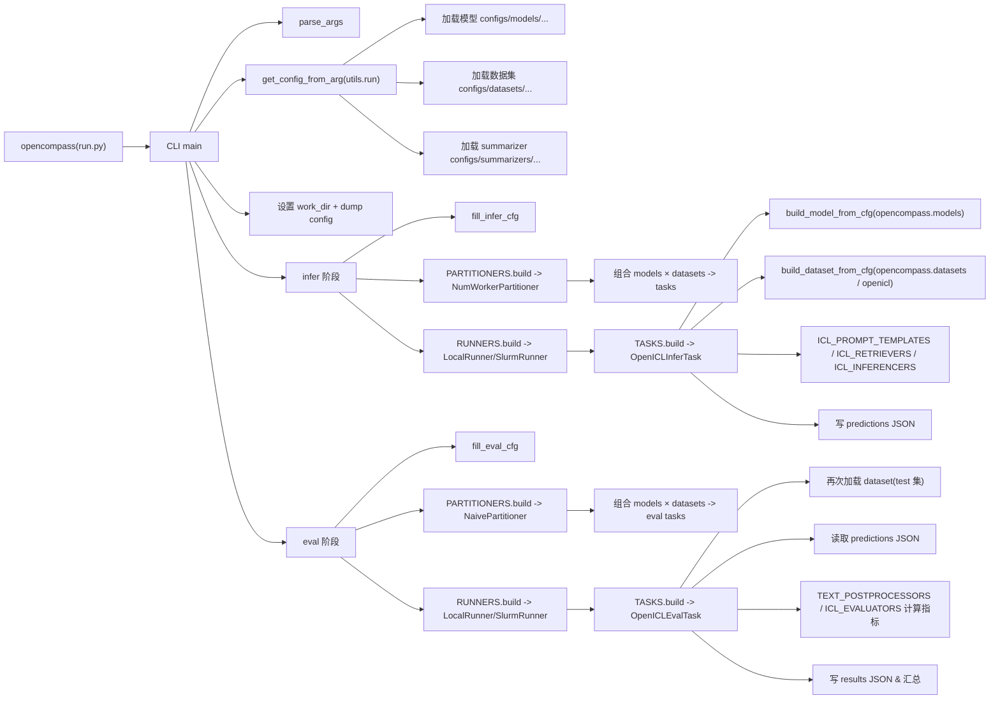

我先从入口脚本和 CLI 主文件入手阅读源码，然后顺藤摸瓜追踪一次完整执行链路，再给你画清楚调用了哪些核心模块。
接下来我会继续顺着 CLI 的 main 流程，重点看 `get_config_from_arg`、`fill_infer_cfg` 等函数，以及你给的模型/数据集对应的配置文件。
下面我按调用链，把你这条命令背后发生的事，从入口到模型/数据集执行过程，结合源码梳理一遍：

命令如下（等价形式）：
```bash
opencompass --models qwen3_30b_a3b_thinking_2507 --datasets TheoremQA_gen
# 通常等价于
python run.py --models qwen3_30b_a3b_thinking_2507 --datasets TheoremQA_gen
```

---

## 1. 入口：`run.py` 和 CLI 主函数

入口脚本：

```python
# d:\project\opencompass\run.py
from opencompass.cli.main import main

if __name__ == '__main__':
    main()
```

也就是说：

- 无论是 `python run.py` 还是 `opencompass` 这个控制台命令，最终都会调用：
  - `opencompass.cli.main.main()`

---

## 2. CLI 参数解析：`opencompass.cli.main.parse_args`

主文件：`opencompass/cli/main.py`

关键函数：

```python
def parse_args():
    parser = argparse.ArgumentParser(description='Run an evaluation task')
    parser.add_argument('config', nargs='?', help='Train config file path')

    # 启动方式：本地 / slurm / dlc
    launch_method = parser.add_mutually_exclusive_group()
    launch_method.add_argument('--slurm', action='store_true', ...)
    launch_method.add_argument('--dlc', action='store_true', ...)

    # 快捷参数：models / datasets / summarizer
    parser.add_argument('--models', nargs='+', help='', default=None)
    parser.add_argument('--datasets', nargs='+', help='', default=None)
    parser.add_argument('--summarizer', help='', default=None)

    # 运行模式：infer / eval / all / viz（默认 all）
    parser.add_argument('-m', '--mode',
                        choices=['all', 'infer', 'eval', 'viz'],
                        default='all')

    # 其它通用参数：--work-dir、--reuse、--debug、--accelerator 等等
    ...
    # slurm / dlc / hf / custom dataset 专属参数
    parse_slurm_args(...)
    parse_dlc_args(...)
    parse_hf_args(...)
    parse_custom_dataset_args(...)

    args = parser.parse_args()
    ...
    return args
```

对你的命令：

- `args.config = None`
- `args.models = ['qwen3_30b_a3b_thinking_2507']`
- `args.datasets = ['TheoremQA_gen']`
- 没指定 `-m`，所以 `args.mode = 'all'`，会跑 **推理 + 评测** 两个阶段。
- [[cli详细运行参数]]
---

## 3. 从参数构造总配置：`get_config_from_arg`

在 `main()` 中：

```python
def main():
    args = parse_args()
    ...
    cfg = get_config_from_arg(args)
    ...
```

对应函数在：`opencompass/utils/run.py`

### 3.1 总体逻辑

```python
def get_config_from_arg(args) -> Config:
    """
    配置的优先级：
    1. args.config  (直接给一个大配置文件)
    2. args.models + args.datasets
    3. HF 参数组 + args.datasets
    """

    if args.config:
        # 这里走单一 config 文件分支（你没给 config，所以不会走这里）
        ...

    # === 下面是你当前这种：只给 models + datasets ===
    # 先解析 datasets，再解析 models，再解析 summarizer
```

### 3.2 解析 datasets：定位 TheoremQA 的配置

关键片段：

```python
# 如果既没有 datasets，又没有自定义数据路径，会报错
if not args.datasets and not args.custom_dataset_path:
    raise ValueError(...)

datasets = []
if args.datasets:
    script_dir = os.path.dirname(os.path.abspath(__file__))
    parent_dir = os.path.dirname(script_dir)
    default_configs_dir = os.path.join(parent_dir, 'configs')
    datasets_dir = [
        os.path.join(args.config_dir, 'datasets'),
        os.path.join(args.config_dir, 'dataset_collections'),
        os.path.join(default_configs_dir, './datasets'),
        os.path.join(default_configs_dir, './dataset_collections'),
    ]
    for dataset_arg in args.datasets:
        if '/' in dataset_arg:
            dataset_name, dataset_suffix = dataset_arg.split('/', 1)
            dataset_key_suffix = dataset_suffix
        else:
            dataset_name = dataset_arg
            dataset_key_suffix = '_datasets'

        for dataset in match_cfg_file(datasets_dir, [dataset_name]):
            logger.info(f'Loading {dataset[0]}: {dataset[1]}')
            cfg = Config.fromfile(dataset[1])
            for k in cfg.keys():
                if k.endswith(dataset_key_suffix):
                    datasets += cfg[k]
```

也就是说：

1. 它在以下目录中查找 **配置文件名为** `TheoremQA_gen.py` 的文件（或能匹配的）：

   - `configs/datasets`
   - `configs/dataset_collections`
   - `opencompass/configs/datasets`
   - `opencompass/configs/dataset_collections`

2. 找到对应 `.py` 后，通过 `Config.fromfile` 读取。
3. 在配置文件中找所有 **key 以 `_datasets` 结尾** 的字段，例如：
   - `TheoremQA_gen_datasets = [...]`
4. 把这些列表里的每个数据集配置 dict 追加到总 `datasets` 里。

> 你可以用 `python tools/list_configs.py --datasets TheoremQA` 来辅助确认实际匹配到的配置文件路径和 key 名。

### 3.3 解析 models：定位 Qwen3 模型配置

后半段：

```python
# 没有 models 也没有 hf_path 会报错
if not args.models and not args.hf_path:
    raise ValueError(...)

models = []
script_dir = os.path.dirname(os.path.abspath(__file__))
parent_dir = os.path.dirname(script_dir)
default_configs_dir = os.path.join(parent_dir, 'configs')
models_dir = [
    os.path.join(args.config_dir, 'models'),
    os.path.join(default_configs_dir, './models'),
]

if args.models:
    for model_arg in args.models:
        for model in match_cfg_file(models_dir, [model_arg]):
            logger.info(f'Loading {model[0]}: {model[1]}')
            cfg = Config.fromfile(model[1])
            if 'models' not in cfg:
                raise ValueError(...)
            models += cfg['models']
else:
    # 走 HF 模型直接构造的分支（你这次没有）
    ...
```

对你的命令：

- 它会去上面两个目录中，寻找 **文件名为 `qwen3_30b_a3b_thinking_2507.py` 的配置**（或能匹配到的）。
- 该 config 文件中应有一个 `models = [...]` 或类似名称的字段，最终把列表里的每个模型配置 dict 收集到 `models` 里。

### 3.4 解析 summarizer

如果你没给 `--summarizer`，默认是 `'example'`：

```python
summarizer_arg = args.summarizer if args.summarizer is not None else 'example'
...
summarizers_dir = [
    os.path.join(args.config_dir, 'summarizers'),
    os.path.join(default_configs_dir, './summarizers'),
]
...
s = match_cfg_file(summarizers_dir, [summarizer_file])[0]
cfg = Config.fromfile(s[1])
summarizer = cfg[summarizer_key]  # 默认 key 是 'summarizer'
```

### 3.5 返回整体 Config 对象

最后：

```python
return Config(
    dict(models=models, datasets=datasets, summarizer=summarizer),
    format_python_code=False
)
```

到这里，你的 CLI 参数就被转成了一个大的 `cfg` 对象，里面有：

- `cfg.models`：Qwen3 30B 那个/那些模型配置 dict
- `cfg.datasets`：TheoremQA 的一个或多个数据集配置 dict
- `cfg.summarizer`：汇总/可视化配置

---

## 4. 实验目录 & 配置落盘

回到 `opencompass.cli.main.main()`：

```python
cfg = get_config_from_arg(args)

# work_dir 设置
if args.work_dir is not None:
    cfg['work_dir'] = args.work_dir
else:
    cfg.setdefault('work_dir', os.path.join('outputs', 'default'))

# 生成时间戳、处理 --reuse
cfg_time_str = dir_time_str = datetime.now().strftime('%Y%m%d_%H%M%S')
...
cfg['work_dir'] = osp.join(cfg.work_dir, dir_time_str)
current_workdir = cfg['work_dir']
logger.info(f'Current exp folder: {current_workdir}')

os.makedirs(osp.join(cfg.work_dir, 'configs'), exist_ok=True)

# 把当前 cfg dump 成一个独立的 config 文件
output_config_path = osp.join(cfg.work_dir, 'configs',
                              f'{cfg_time_str}_{os.getpid()}.py')
cfg.dump(output_config_path)

# 再用 mmengine Config 重载一次，保证类型干净
cfg = Config.fromfile(output_config_path, format_python_code=False)
```

此时你会在类似目录看到生成的配置：

- `outputs/default/<时间戳>/configs/<时间戳>_<pid>.py`

这个配置包含了 models + datasets + summarizer + infer/eval 相关字段（后面还会再 merge）。

---

## 5. 推理阶段（infer）：如何把模型和数据集跑起来

main 里：

```python
# infer
if args.mode in ['all', 'infer']:
    ...
    if args.dlc or args.slurm or cfg.get('infer', None) is None:
        fill_infer_cfg(cfg, args)
    ...
    cfg.infer.partitioner['out_dir'] = osp.join(cfg['work_dir'], 'predictions/')
    partitioner = PARTITIONERS.build(cfg.infer.partitioner)
    tasks = partitioner(cfg)
    if args.dry_run:
        return
    runner = RUNNERS.build(cfg.infer.runner)
    ...
    runner(tasks)
```

### 5.1 自动补全 infer 配置：`fill_infer_cfg`

`opencompass/utils/run.py`：

```python
def fill_infer_cfg(cfg, args):
    new_cfg = dict(
        infer=dict(
            partitioner=dict(
                type=get_config_type(NumWorkerPartitioner),
                num_worker=args.max_num_workers),
            runner=dict(
                max_num_workers=args.max_num_workers,
                debug=args.debug,
                task=dict(type=get_config_type(OpenICLInferTask)),
                lark_bot_url=cfg['lark_bot_url'],
            )
        ),
    )

    if args.slurm:
        new_cfg['infer']['runner']['type'] = get_config_type(SlurmRunner)
        ...
    elif args.dlc:
        new_cfg['infer']['runner']['type'] = get_config_type(DLCRunner)
        ...
    else:
        new_cfg['infer']['runner']['type'] = get_config_type(LocalRunner)
        new_cfg['infer']['runner']['max_workers_per_gpu'] = args.max_workers_per_gpu

    cfg.merge_from_dict(new_cfg)
```

也就是说：

- `cfg.infer.partitioner`：默认用 `NumWorkerPartitioner`（在 `opencompass.partitioners` 中）
- `cfg.infer.runner`：
  - 默认用 `LocalRunner`（在 `opencompass.runners` 中）  
  - 如果指定 `--slurm`，则用 `SlurmRunner`  
  - 如果指定 `--dlc`，则用 `DLCRunner`
- `runner.task.type` 被设为 `OpenICLEvalTask` 的全路径字符串。

### 5.2 构造任务列表：`PARTITIONERS.build(...)(cfg)`

`PARTITIONERS` 是在 `opencompass.registry` 中注册的分区器 Registry。

核心逻辑在 `opencompass/partitioners/base.py`（简要）：

```python
def parse_model_dataset_args(self, cfg: ConfigDict):
    models = cfg['models']
    datasets = cfg['datasets']
    ...
    combs = [{'models': models, 'datasets': datasets}]
    ...
```

`NumWorkerPartitioner` 会把 `cfg.models` 和 `cfg.datasets` 组合成一系列 **任务配置**，每个任务通常是：

- 一组模型（很多情况下就一个）  
- 一组数据集（很多情况下就一个，如 TheoremQA 某个配置）

最终得到一个 `tasks` 列表，交给 runner 去执行。

### 5.3 Runner：`LocalRunner / SlurmRunner / DLCRunner`

`runner = RUNNERS.build(cfg.infer.runner)`  

- `RUNNERS` 同样来自 `opencompass.registry`。
- `LocalRunner` 会在本机上按进程/线程方式调度这些任务：
  1. 对每个 task，用 TASKS registry 构造真正的 Task 对象（这里是 `OpenICLInferTask`）。
  2. 调用 task 的 `get_command()` / `run()` 等方法，启动实际的推理脚本（可能通过子进程、torch.distributed 等）。

你在 `OpenICLInferTask.get_command` 中可以看到它构造的真实命令（如果是分布式推理，还会加上 `torch.distributed.run`）。

---

## 6. 具体推理逻辑：`opencompass.tasks.openicl_infer.OpenICLInferTask`

文件：`opencompass/tasks/openicl_infer.py`

核心流程：

```python
@TASKS.register_module()
class OpenICLInferTask(BaseTask):

    def __init__(self, cfg: ConfigDict):
        super().__init__(cfg)
        run_cfg = self.model_cfgs[0].get('run_cfg', {})
        self.num_gpus = run_cfg.get('num_gpus', 0)
        self.num_procs = run_cfg.get('num_procs', 1)
        self.logger = get_logger()

    def run(self, cur_model=None, cur_model_abbr=None):
        for model_cfg, dataset_cfgs in zip(self.model_cfgs, self.dataset_cfgs):
            self.model = build_model_from_cfg(model_cfg)  # 构造模型实例

            for dataset_cfg in dataset_cfgs:
                self.model_cfg = model_cfg
                self.dataset_cfg = dataset_cfg
                self.infer_cfg = self.dataset_cfg['infer_cfg']
                self.dataset = build_dataset_from_cfg(self.dataset_cfg)  # 构造数据集

                out_path = get_infer_output_path(...)
                if osp.exists(out_path):
                    continue
                self._inference()
```

`_inference()` 里：

```python
# 构造 prompt template
if hasattr(self.infer_cfg, 'ice_template'):
    ice_template = ICL_PROMPT_TEMPLATES.build(self.infer_cfg['ice_template'])
if hasattr(self.infer_cfg, 'prompt_template'):
    prompt_template = ICL_PROMPT_TEMPLATES.build(self.infer_cfg['prompt_template'])

# 构造 retriever（检索 in-context 示例）
retriever_cfg = self.infer_cfg['retriever'].copy()
retriever_cfg['dataset'] = self.dataset
retriever = ICL_RETRIEVERS.build(retriever_cfg)

# 构造 inferencer（负责循环样本、调用模型）
inferencer_cfg = self.infer_cfg['inferencer']
inferencer_cfg['model'] = self.model
...
inferencer = ICL_INFERENCERS.build(inferencer_cfg)

# 输出文件路径
out_path = get_infer_output_path(...)
out_dir, out_file = osp.split(out_path)
mkdir_or_exist(out_dir)

# 真正开始推理
inferencer.inference(
    retriever,
    ice_template=...,
    prompt_template=...,
    output_json_filepath=out_dir,
    output_json_filename=out_file,
)
```

这里涉及的模块主要有：

- `opencompass.utils.build_model_from_cfg`  
  → 使用 `opencompass.models` 下注册的模型类（包括 HF、VLLM、Qwen 等）构造具体模型实例。
- `opencompass.utils.build_dataset_from_cfg`  
  → 使用 `opencompass.datasets` / `openicl.icl_dataset_reader` 中的 Reader + Dataset 类读取 TheoremQA 的原始数据。
- `opencompass.registry` 中的：
  - `ICL_PROMPT_TEMPLATES`
  - `ICL_RETRIEVERS`
  - `ICL_INFERENCERS`
- 预测结果以 JSON 格式写到：
  - `outputs/default/<time>/predictions/...json`

对你关心的 TheoremQA 来说：

- 具体哪一个 reader 在读数据，取决于 TheoremQA 的 dataset 配置文件中 `reader_cfg.type` 指向的类。
- 这个 reader 很可能在你当前打开的 `openicl/icl_dataset_reader.py` 或相关 openicl 模块中被注册。

---

## 7. 评测阶段（eval）：加载预测 + 打分

`main()` 中：

```python
# evaluate
if args.mode in ['all', 'eval']:
    if args.dlc or args.slurm or cfg.get('eval', None) is None:
        fill_eval_cfg(cfg, args)

    if args.dump_eval_details:
        cfg.eval.runner.task.dump_details = True
    if args.dump_extract_rate:
        cfg.eval.runner.task.cal_extract_rate = True

    cfg.eval.partitioner['out_dir'] = osp.join(cfg['work_dir'], 'results/')
    partitioner = PARTITIONERS.build(cfg.eval.partitioner)
    tasks = partitioner(cfg)
    ...
    runner = RUNNERS.build(cfg.eval.runner)
    ...
    runner(tasks)
```

### 7.1 自动补全 eval 配置：`fill_eval_cfg`

同样在 `opencompass/utils/run.py`：

```python
def fill_eval_cfg(cfg, args):
    new_cfg = dict(
        eval=dict(
            partitioner=dict(type=get_config_type(NaivePartitioner)),
            runner=dict(
                max_num_workers=args.max_num_workers,
                debug=args.debug,
                task=dict(type=get_config_type(OpenICLEvalTask)),
                lark_bot_url=cfg['lark_bot_url'],
            )
        )
    )
    # slurm/dlc/local 的分支和 infer 类似
    ...
    cfg.merge_from_dict(new_cfg)
```

和 infer 类似：

- `cfg.eval.partitioner`：默认 `NaivePartitioner`
- `cfg.eval.runner`：`LocalRunner / SlurmRunner / DLCRunner`
- `cfg.eval.runner.task.type`：`OpenICLEvalTask`

### 7.2 具体评测逻辑：`opencompass.tasks.openicl_eval.OpenICLEvalTask`

文件：`opencompass/tasks/openicl_eval.py`

执行流程：

```python
def run(self):
    for model_cfg, dataset_cfgs in zip(self.model_cfgs, self.dataset_cfgs):
        for dataset_cfg in dataset_cfgs:
            self.model_cfg = model_cfg
            self.dataset_cfg = dataset_cfg

            # 拿到 eval_cfg 和输出列名
            self.eval_cfg = copy.deepcopy(dataset_cfg.get('eval_cfg'))
            self.output_column = copy.deepcopy(
                dataset_cfg['reader_cfg']['output_column'])

            out_path = get_infer_output_path(..., osp.join(self.work_dir, 'results'))
            if osp.exists(out_path):
                continue
            self._score()
```

`_score()` 中：

1. `_load_and_preprocess_test_data()`  
   - 用 `build_dataset_from_cfg(self.dataset_cfg).test` 加载原始 test 集（再次通过数据集 reader）。
   - 如果配置里有 `dataset_postprocessor`，会对样本做预处理。

2. `_load_predictions()`  
   - 从 `work_dir/predictions/...json` 里加载推理阶段写出的预测结果。

3. `_process_predictions()`  
   - 通过 `TEXT_POSTPROCESSORS` registry 应用模型 / 数据集指定的 postprocessor，如裁剪冗余文本、提取答案字母等。

4. `_evaluate_predictions()`  
   - 使用 `ICL_EVALUATORS` registry 中的评测器，计算指标：
     ```python
     evaluator_cfg = self.eval_cfg.get('evaluator', {})
     evaluator_type = evaluator_cfg.get('type')
     if isinstance(evaluator_type, str):
         evaluator_type = ICL_EVALUATORS.get(evaluator_type)
     evaluator = evaluator_type(...)
     result = evaluator(...)
     ```
   - 对 TheoremQA 这类数学题，通常会有专门的 evaluator（例如数学等价判断等），在 `opencompass/metrics` 里实现并注册。

5. `_save_results()`  
   - 把结果写到 `work_dir/results/...`，并可能被 summarizer 汇总。

---

## 8. 总体模块调用关系小结

用一个简单的调用链来总结：



---

## 9. 如果你想“顺着源码看具体到 TheoremQA / Qwen3”

你可以按下面顺序自己跟一下源码（比较符合你“源码优先”的习惯）：

1. **从 CLI 到总配置**
   - `opencompass/cli/main.py`
   - `opencompass/utils/run.py` 的 `get_config_from_arg`、`fill_infer_cfg`、`fill_eval_cfg`

2. **找到具体的模型 / 数据集配置文件**
   - 用工具脚本：
     ```bash
     python tools/list_configs.py --models qwen3_30b_a3b_thinking_2507
     python tools/list_configs.py --datasets TheoremQA
     ```
   - 打开输出路径指出的 `.py` 看里面的 `models` / `*_datasets` 定义。

3. **模型实现**
   - `opencompass/models/...` 对应 Qwen3 30B 的类（在模型配置的 `type` 字段里可以看到全类名）。

4. **数据集读取**
   - 打开 TheoremQA 的 dataset config，看 `reader_cfg.type` 指向哪一个 reader。
   - 在 `openicl/icl_dataset_reader.py` 或 `opencompass/datasets/...` 中找到对应的 reader / dataset 类，看它如何读取 TheoremQA 的原始 JSON/CSV。

5. **推理与评测**
   - `opencompass/tasks/openicl_infer.py`：推理流程（retriever、inferencer、prompt 模板）。
   - `opencompass/tasks/openicl_eval.py`：评测流程（加载预测、构造 evaluator）。
   - `opencompass/metrics/...`：TheoremQA 相关 evaluator 的具体实现。

如果你愿意，我可以帮你“点名”找出你本地实际匹配到的 Qwen3 / TheoremQA 配置文件，并进一步解释这两个配置内部字段各自代表什么。